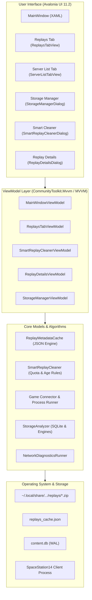

# 🚀 Space Station 14 Launcher

<div align="center">

[](https://github.com/MeiDoto/SS14.Launcher/actions/workflows/build-test.yml)
[](https://github.com/MeiDoto/SS14.Launcher/releases/latest)
[](https://github.com/MeiDoto/SS14.Launcher)
[](https://dotnet.microsoft.com/)
[](https://avaloniaui.net/)
[](https://github.com/MeiDoto/SS14.Launcher/releases/latest)
[](LICENSE.txt)

**[🇷🇺 Читать на русском](README.md)** | **[🇬🇧 Read in English](README.en.md)**

*A modern, ultra-fast, and robust cross-platform game launcher for **[Space Station 14](https://spacestation14.com/)**.*

</div>

---

## 📖 Overview

Built with **C# / .NET 10** and the declarative **Avalonia UI 11.2** framework, the launcher delivers instantaneous startup times, secure process sandboxing, low memory overhead, and native integration across modern Linux distributions (Wayland/X11), Windows 10/11, and macOS.

---

## 📥 Download & Installation

Precompiled standalone release binaries are available directly on the **[GitHub Releases Page](https://github.com/MeiDoto/SS14.Launcher/releases/latest)**:

| Platform | Package Format | Quick Start Guide |
| :--- | :--- | :--- |
| 🪟 **Windows** | `SS14.Launcher_Windows.zip` | Extract archive and launch `Space Station 14 Launcher.exe` |
| 🐧 **Linux (Standalone)** | `SS14.Launcher_Linux.tar.gz` | Extract, run `./setup-desktop.sh` (desktop integration) and `./SS14.Launcher` |
| 📦 **Linux (Flatpak)** | `org.spacestation14.launcher.yml` | Build manifest via `flatpak-builder` |
| 🍏 **macOS** | `SS14.Launcher_macOS.zip` | Extract and open `Space Station 14 Launcher.app` |

> [!TIP]
> All binary distributions are completely self-contained — the .NET 10 runtime and required dependencies are bundled directly inside.

---

## ✨ Key Features

### 🎮 Server Discovery & Network Stack
- **Instant Server Search** — SIMD-accelerated Jaro-Winkler hybrid fuzzy ranking algorithm.
- **Adaptive Ping Filtering** — 1D Kalman filter combined with Jitter-Adaptive EMA for rock-solid latency telemetry.
- **Happy Eyeballs v2** — Dual-stack parallel IPv4/IPv6 probing for ISP-level resilience and zero connection delay.
- **🌐 Network Diagnostics Tool** — Built-in DNS, TCP socket, TLS handshake, jitter, and packet loss analyzer with clipboard export for server staff support.

### 🎬 Next-Gen Replay Management (Replay System 2.0)
- **📥 Direct & User-Centric Downloads (`ReplayDownloader`)**:
  - Instant replay downloads via direct HTTP/HTTPS URLs or custom server `{roundId}` templates.
  - Zero third-party coupling — pure client-side I/O without proprietary vendor lock-in.
  - Streaming I/O with **256 KB** memory-pooled buffers via `ArrayPool<byte>.Shared` (zero LOH allocations).
  - Exponential moving average speed smoothing (EMA, $\alpha=0.35$) and real-time ETA calculation.
  - Smart clipboard auto-detection for replay URLs and round numbers.
- **⚡ High-Performance Caching Engine (`ReplayMetadataCache`)**:
  - Instant loading of hundreds of replays backed by persistent JSON storage (`replays_cache.json`).
  - Fast timestamp and length verification with **0 ms I/O latency** on repeat views.
  - Thread-safe atomic file writes protected by `_saveSemaphore`.
- **⭐ Favorites & Pin-to-Top**:
  - One-click favorite starring directly from cards or the replay inspector.
  - Starred replays automatically pin to the top of the list across all sorting modes.
- **📊 Real-Time Analytics Dashboard**:
  - Quick glance banner displaying total archives, cumulative disk footprint, total game duration, and starred count.
- **🎯 Advanced Filtering & Sorting**:
  - Filter by game mode (`Gamemode`: Traitor, Secret, NukeOps, Extended) and server.
  - Sort by round duration (longest/shortest first), date, file size, or title.
  - Full-text search across notes, maps, servers, and round IDs.
- **📋 Rich Card Actions**:
  - ▶ **Play** directly in game client.
  - 📋 **Share / Copy** — generates formatted Discord/Markdown round summary cards.
  - 📂 **In Folder** — opens file in system file manager.
  - 📤 **Export** — saves a copy of the replay to any chosen folder.
  - ℹ️ **Details** — opens technical metadata inspector.
- **🧹 Smart Replay Cleaner (`SmartReplayCleaner`)**:
  - Automated pruning by age (older than 14, 30, 60, or 90 days).
  - Corrupted and truncated archive detection and cleanup.
  - Disk quota limits (keep newest replays under 1 GB, 2 GB, 5 GB, 10 GB).
  - Favorite protection (⭐ never deleted automatically).
- **📥 Batch Multi-Select Mode**:
  - Checkbox selection with "Select All", "Deselect All", and batch deletion.
- **🔍 Technical Replay Inspector**:
  - Asynchronous **SHA-256** cryptographic hash verification and copying.
  - Archive compression ratio calculation (`Saved X%`).
  - Custom user notes and round impressions editor with persistent storage.

### 💾 Storage & Performance Optimization
- **Storage Manager (`StorageManager`)** — transparent breakdown of SQLite database, WAL journal, Robust engines, logs, and replays.
- **Database Vacuum** — selective engine version removal and safe background database defragmentation (`VACUUM`).
- **ZipSlip / TarSlip Hardening** — strict path validation during engine and content extraction.

### 🎨 Customization & User Experience
- **Visual Theming** — customizable accent color palettes, tab strip docking, typography, and video wallpaper support.
- **Multi-Account Manager** — seamless switching between Space Station 14 accounts without password prompts.
- **Bilingual Interface** — full English and Russian translations with live dynamic language switching.

---

## 🏛️ System Architecture



---

## 🖥️ Verified Operating Systems

| Platform | Distro / OS Version | Architecture | Display & Runtime | Status |
| :--- | :--- | :--- | :--- | :---: |
| **Linux** | **CachyOS** (Linux 6.x+, x86-64-v3/v4 / Zen) | `x64` | .NET 10 + Wayland / X11 | ✅ Verified |
| **Linux** | **Arch Linux** | `x64` | .NET 10 + Wayland / X11 | ✅ Verified |
| **Linux** | **Ubuntu 24.04 / 22.04 LTS** | `x64`, `arm64` | .NET 10 + GNOME Wayland | ✅ Verified |
| **Linux** | **Fedora 40 / 41** | `x64` | .NET 10 + GNOME / KDE | ✅ Verified |
| **Windows** | **Windows 11 / 10** (22H2+) | `x64`, `arm64` | .NET 10 (NativeAOT Bootstrap) | ✅ Verified |
| **macOS** | **macOS 12–15** (Monterey – Sequoia) | `x64`, `arm64` | .NET 10 Universal | ✅ Verified |

---

## 💻 Building from Source

### Prerequisites
- [.NET 10.0 SDK](https://dotnet.microsoft.com/download)
- Git
- Python 3 (for package distribution script `publish.py`)

### Build and Test Commands

```bash
# 1. Clone repository recursively with submodules
git clone --recursive https://github.com/MeiDoto/SS14.Launcher.git
cd SS14.Launcher

# 2. Build solution in Release configuration
dotnet build -c Release -p:UseSharedCompilation=false

# 3. Execute test suite (225 tests, 100% pass rate)
dotnet test SS14.Launcher.Tests/SS14.Launcher.Tests.csproj --configuration Release

# 4. Run launcher locally
dotnet run --project SS14.Launcher/SS14.Launcher.csproj

# 5. Build standalone release archives
python3 publish.py windows linux
```

---

## 📂 Storage Directories

| OS | User Data & Cache | Logs Directory | Replays Directory |
| :--- | :--- | :--- | :--- |
| **Windows** | `%APPDATA%\Space Station 14\launcher\` | `...\launcher\logs\` | `...\launcher\replays\` |
| **Linux** | `~/.local/share/Space Station 14/launcher/` | `.../launcher/logs/` | `.../launcher/replays/` |
| **macOS** | `~/Library/Application Support/Space Station 14/launcher/` | `.../launcher/logs/` | `.../launcher/replays/` |

---

## 📚 Technical Documentation & Architecture Decision Records (ADR)

- 🏛️ **[Architecture & Subsystems](docs/ARCHITECTURE.md)** ([Русский](docs/ARCHITECTURE.ru.md))
- 📋 **Architecture Decision Records (ADR)**:
  - [ADR 0001: Core Architecture, Modularity & Performance](docs/adr/0001-architecture-decisions.md)
  - [ADR 0002: Async Safety & Error Handling Policy](docs/adr/0002-async-safety-error-handling.md)
  - [ADR 0003: Continuous Integration & Deployment Pipeline Design](docs/adr/0003-cicd-pipeline-design.md)
  - [ADR 0004: Replay Subsystem, User-Centric Downloads, I/O Optimization & Architectural Stability](docs/adr/0004-replay-subsystem-and-user-architecture.md)
- 🌐 **[Networking & API Protocols](docs/NETWORKING.md)** ([Русский](docs/NETWORKING.ru.md))
- 🎨 **[Customization & Extensibility](docs/CUSTOMIZATION.md)** ([Русский](docs/CUSTOMIZATION.ru.md))
- 🛡️ **[Security Disclosure & Threat Model](SECURITY.md)** ([Русский](SECURITY.ru.md))
- 🤝 **[Contributing Guidelines](CONTRIBUTING.md)** ([Русский](CONTRIBUTING.ru.md))

---

## 📜 License

Licensed under the permissive **[MIT License](LICENSE.txt)**.
Space Station 14 and related trademarks belong to their respective copyright holders.
