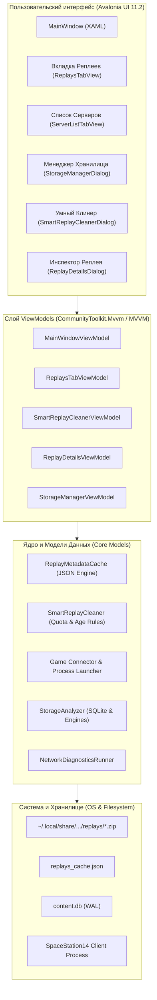

# 🚀 Space Station 14 Launcher

<div align="center">

[](https://github.com/MeiDoto/SS14.Launcher/actions/workflows/build-test.yml)
[](https://github.com/MeiDoto/SS14.Launcher/releases/latest)
[](https://github.com/MeiDoto/SS14.Launcher)
[](https://dotnet.microsoft.com/)
[](https://avaloniaui.net/)
[](https://github.com/MeiDoto/SS14.Launcher/releases/latest)
[](LICENSE.txt)

**[🇷🇺 Читать на русском](README.md)** | **[🇬🇧 Read in English](README.en.md)**

*Современный, сверхбыстрый и надежный кросс-платформенный лаунчер для космической ролевой игры **[Space Station 14](https://spacestation14.com/)**.*

</div>

---

## 📖 О проекте

Лаунчер написан на **C# / .NET 10** с использованием декларативного UI фреймворка **Avalonia UI 11.2**. Он спроектирован для мгновенного отклика, безопасного запуска игровых сессий, низкого потребления оперативной памяти и нативной интеграции с современными дистрибутивами Linux (Wayland/X11), Windows 10/11 и macOS.

---

## 📥 Загрузка и установка

Готовые релизные сборки доступны на странице **[Релизов GitHub](https://github.com/MeiDoto/SS14.Launcher/releases/latest)**:

| Платформа | Формат пакета | Инструкция по запуску |
| :--- | :--- | :--- |
| 🪟 **Windows** | `SS14.Launcher_Windows.zip` | Распаковать архив и запустить `Space Station 14 Launcher.exe` |
| 🐧 **Linux (Портативный)** | `SS14.Launcher_Linux.tar.gz` | Распаковать, запустить `./setup-desktop.sh` (для создания ярлыков) и `./SS14.Launcher` |
| 📦 **Linux (Flatpak)** | `org.spacestation14.launcher.yml` | Сборка манифеста через `flatpak-builder` |
| 🍏 **macOS** | `SS14.Launcher_macOS.zip` | Распаковать и открыть `Space Station 14 Launcher.app` |

> [!TIP]
> Все дистрибутивы полностью автономны (Self-Contained) — рантайм .NET 10 и все системные библиотеки уже включены в поставку.

---

## ✨ Ключевые возможности

### 🎮 Поиск и сетевой стек
- **Мгновенный поиск серверов** — гибридный алгоритм ранжирования Jaro-Winkler с SIMD-ускорением для нечеткого поиска серверов.
- **Адаптивный фильтр пинга** — 1D фильтр Калмана в сочетании с Jitter-Adaptive EMA для точной фильтрации сетевых скачков без ложных задержек.
- **Happy Eyeballs v2** — параллельное подключение IPv4/IPv6 для обхода провайдерских задержек и блокировок.
- **🌐 Диагностика сети** — встроенный модуль проверки DNS, TCP сокетов, TLS-сертификатов, джиттера и потерь пакетов с экспортом отчета для технической поддержки.

### 🎬 Система реплеев нового поколения (Replay System 2.0)
- **📥 Прямое и пользовательское скачивание (`ReplayDownloader`)**:
  - Мгновенное скачивание архивов записей по прямой HTTP/HTTPS ссылке или пользовательскому шаблону (`{roundId}`).
  - Полная независимость от сторонних серверов — чистый клиентский I/O без привязки к внешним проектам.
  - Потоковая загрузка с буфером **256 КБ** через пул памяти `ArrayPool<byte>.Shared` (нулевые LOH-аллокации).
  - Экспоненциальное сглаживание скорости (EMA, $\alpha=0.35$) и динамический расчет времени до завершения (ETA).
  - Умное авто-распознавание ссылок из системного буфера обмена.
- **⚡ Высокопроизводительное кэширование (`ReplayMetadataCache`)**:
  - Мгновенная загрузка сотен записей благодаря персистентному JSON-кэшу (`replays_cache.json`).
  - Проверка изменений по метке времени и размеру файла — **0 ms I/O задержки** при повторных открытиях.
  - Потокобезопасная асинхронная запись через семафор `_saveSemaphore`.
- **⭐ Избранное и закрепление (Pin-to-Top)**:
  - Быстрое добавление в любимые записи в один клик.
  - Избранные реплеи всегда закрепляются вверху списка при любых режимах сортировки.
- **📊 Сводная панель аналитики (Dashboard)**:
  - Количество записей, суммарный объем на диске, общее зарегистрированное игровое время раундов и счетчик избранных.
- **🎯 Расширенная фильтрация и сортировка**:
  - Фильтры по режиму игры (`Gamemode`: Traitor, Secret, NukeOps и др.) и по серверу.
  - Сортировка по длительности раунда (сначала долгие/короткие), по дате, размеру и названию.
  - Поиск по личным заметкам, номерам раундов и картам.
- **📋 Интерактивные кнопки действий**:
  - ▶ **Воспроизведение** прямо в клиенте игры.
  - 📋 **Поделиться** — генерация красивой карточки раунда в формате Markdown для Discord и форумов.
  - 📂 **В папке** — открытие директории с файлом в системном проводнике.
  - 📤 **Экспорт** — сохранение копии реплея в любую папку.
  - ℹ️ **Инспектор** — расширенный просмотр метаданных.
- **🧹 Умный очиститель диска (Smart Replay Cleaner)**:
  - Автоматическая очистка записей старше 14 / 30 / 60 / 90 дней.
  - Поиск и удаление битых / поврежденных архивов.
  - Ограничение дисковой квоты (хранить не более 1 ГБ, 2 ГБ, 5 ГБ свежих реплеев).
  - Защита избранных записей (⭐) от случайного удаления.
- **📥 Режим пакетного выбора (Batch Multi-Select)**:
  - Чекбоксы массового выбора и безопасное пакетное удаление.
- **🔍 Детальный инспектор**:
  - Асинхронный расчет и копирование криптографического хэша **SHA-256**.
  - Расчет степени сжатия архива (`Saved X%`).
  - Личные заметки и впечатления к раунду с сохранением в кэше.

### 💾 Хранилище и оптимизация
- **Менеджер хранилища (`StorageManager`)** — детальный аудит базы данных SQLite контента, WAL-журнала, версий движка Robust, логов и файлов реплеев.
- **Очистка и сжатие** — удаление устаревших версий движка и фоновый безопасный `VACUUM`.
- **Защита от ZipSlip/TarSlip** — строгая валидация путей при распаковке архивов движка и контента.

### 🎨 Кастомизация и удобство
- **Персонализация внешнего вида** — настройка акцентных цветов, палитры, расположения вкладок, шрифтов и видео-обоев.
- **Мульти-аккаунт** — мгновенное переключение между несколькими учетными записями без повторного ввода пароля.
- **Двуязычный интерфейс** — полная поддержка русского и английского языков с динамическим переключением без перезапуска приложения.

---

## 🏛️ Архитектура приложения



---

## 🖥️ Поддерживаемые платформы

| Платформа | Дистрибутив / Версия ОС | Архитектура | Графика & Среда | Статус |
| :--- | :--- | :--- | :--- | :---: |
| **Linux** | **CachyOS** (Linux 6.x+, x86-64-v3/v4 / Zen) | `x64` | .NET 10 + Wayland / X11 | ✅ Идеально |
| **Linux** | **Arch Linux** | `x64` | .NET 10 + Wayland / X11 | ✅ Идеально |
| **Linux** | **Ubuntu 24.04 / 22.04 LTS** | `x64`, `arm64` | .NET 10 + GNOME Wayland | ✅ Идеально |
| **Linux** | **Fedora 40 / 41** | `x64` | .NET 10 + GNOME / KDE | ✅ Идеально |
| **Windows** | **Windows 11 / 10** (22H2+) | `x64`, `arm64` | .NET 10 (NativeAOT Bootstrap) | ✅ Идеально |
| **macOS** | **macOS 12–15** (Monterey – Sequoia) | `x64`, `arm64` | .NET 10 Universal | ✅ Идеально |

---

## 💻 Сборка и разработка

### Необходимые инструменты
- [.NET 10.0 SDK](https://dotnet.microsoft.com/download)
- Git
- Python 3 (для скрипта публикации `publish.py`)

### Команды сборки и тестирования

```bash
# 1. Клонирование репозитория
git clone --recursive https://github.com/MeiDoto/SS14.Launcher.git
cd SS14.Launcher

# 2. Сборка решения в конфигурации Release
dotnet build -c Release -p:UseSharedCompilation=false

# 3. Запуск полного набора автоматических тестов (225 тестов, 100% успех)
dotnet test SS14.Launcher.Tests/SS14.Launcher.Tests.csproj --configuration Release

# 4. Локальный запуск приложения
dotnet run --project SS14.Launcher/SS14.Launcher.csproj

# 5. Сборка автономных релизных пакетов
python3 publish.py windows linux
```

---

## 📂 Расположение файлов данных

| ОС | Каталог пользовательских данных | Каталог логов | Каталог записей реплеев |
| :--- | :--- | :--- | :--- |
| **Windows** | `%APPDATA%\Space Station 14\launcher\` | `...\launcher\logs\` | `...\launcher\replays\` |
| **Linux** | `~/.local/share/Space Station 14/launcher/` | `.../launcher/logs/` | `.../launcher/replays/` |
| **macOS** | `~/Library/Application Support/Space Station 14/launcher/` | `.../launcher/logs/` | `.../launcher/replays/` |

---

## 📚 Документация подсистем и архитектурные решения (ADR)

- 🏛️ **[Архитектура и подсистемы](docs/ARCHITECTURE.ru.md)** ([English](docs/ARCHITECTURE.md))
- 📋 **Архитектурные рекорды (ADR)**:
  - [ADR 0001: Базовая архитектура, модульность и производительность](docs/adr/0001-architecture-decisions.ru.md)
  - [ADR 0002: Политика Async-безопасности и обработки ошибок](docs/adr/0002-async-safety-error-handling.ru.md)
  - [ADR 0003: Дизайн конвейера непрерывной интеграции (CI/CD)](docs/adr/0003-cicd-pipeline-design.ru.md)
  - [ADR 0004: Подсистема реплеев, пользовательская загрузка, оптимизация I/O и архитектурная стабильность](docs/adr/0004-replay-subsystem-and-user-architecture.ru.md)
- 🌐 **[Сетевые протоколы и API](docs/NETWORKING.ru.md)** ([English](docs/NETWORKING.md))
- 🎨 **[Кастомизация и оформление](docs/CUSTOMIZATION.ru.md)** ([English](docs/CUSTOMIZATION.md))
- 🛡️ **[Политика безопасности](SECURITY.ru.md)** ([English](SECURITY.md))
- 🤝 **[Руководство контрибьютора](CONTRIBUTING.ru.md)** ([English](CONTRIBUTING.md))

---

## 📜 Лицензия

Проект распространяется под открытой лицензией **[MIT](LICENSE.txt)**.
Материалы, код Space Station 14 и торговые марки принадлежат их законным авторам.
