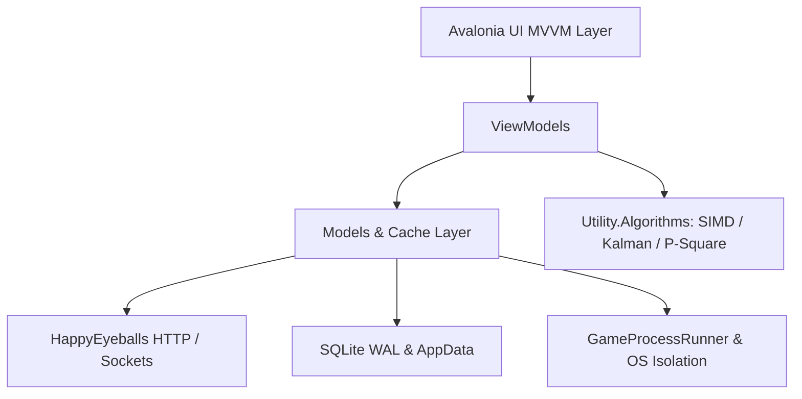

# 🚀 SS14.Launcher

[](https://github.com/MeiDoto/SS14.Launcher/actions/workflows/build-test.yml)
[](https://github.com/MeiDoto/SS14.Launcher/actions/workflows/publish-release.yml)
[](https://opensource.org/licenses/MIT)

**SS14.Launcher** is the official modern cross-platform game launcher for [Space Station 14](https://spacestation14.com/), engineered with **Avalonia UI** and **.NET 10.0**.

---

## ✨ Features

- 🎮 **Seamless Game Connection**: Direct connect via `ss14://` / `ss14s://` links, server browser with filtering, favorite lists, and ping telemetry.
- ⚡ **High Performance Core**:
  - Hardware-accelerated SIMD text searching with `Vector256` / `Vector128`.
  - 1D Kalman Filter with Chi-squared gating for jitter estimation and latency spike suppression.
  - Hybrid LRU + TTL memory caching for instantaneous hub list navigation.
  - Zero-allocation `ValueResult<T>` operation pipelines and `ArrayPool<byte>` streaming.
- 🎨 **Visual Customizer**: Custom themes, animated backgrounds, UI scaling, and live accent color customization.
- 🎬 **Integrated Replay Player**: One-click Space Station 14 round replay loading from `.zip` archives.
- 🛠️ **Developer Suite**: In-game DEV overlays, physics/lighting debug toggles, benchmark suite, and local build runner.
- 🌐 **Full Internationalization (i18n)**: English and Russian localizations with dynamic live switching.
- 🔒 **Security Hardening**: Strict ZipSlip traversal defenses, token encryption, and isolated process priority control.

---

## 💻 System Requirements

| OS | Minimum Architecture | Runtime |
|---|---|---|
| **Linux** | x86_64, arm64 (glibc 2.31+) | Bundled self-contained |
| **Windows** | Windows 10/11 x64 | Bundled self-contained |
| **macOS** | macOS 12+ (x64 / Apple Silicon) | Bundled self-contained |

---

## 🛠️ Building from Source

### Prerequisites
- [.NET 10.0 SDK](https://dotnet.microsoft.com/download)
- Git

### Build Steps

```bash
# Clone repository with submodules
git clone --recursive https://github.com/MeiDoto/SS14.Launcher.git
cd SS14.Launcher

# Restore dependencies
dotnet restore

# Build Release binary
dotnet build --configuration Release

# Run automated tests
dotnet test SS14.Launcher.Tests/SS14.Launcher.Tests.csproj -v normal
```

---

## 🏛️ Architecture Overview



---

## 🤝 Contributing

We welcome contributions! Please see [CONTRIBUTING.md](CONTRIBUTING.md) for code style guidelines, test conventions, and architecture decision records.

## 🔒 Security

See [SECURITY.md](SECURITY.md) for our security policy, vulnerability reporting process, and security measures.

## 📖 Architecture Decision Records

- [ADR-0001: Core Architecture & Performance Design](docs/adr/0001-architecture-decisions.md)
- [ADR-0002: Async Safety & Error Handling Policy](docs/adr/0002-async-safety-error-handling.md)
- [ADR-0003: CI/CD Pipeline Design](docs/adr/0003-cicd-pipeline-design.md)

---

## 📜 License

This project is licensed under the [MIT License](LICENSE.txt).
