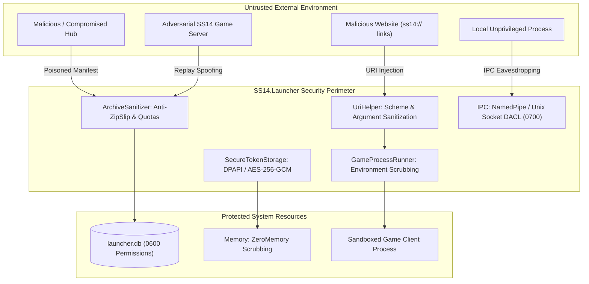

# 🛡️ SS14.Launcher Security Policy

[🇬🇧 Read in English](SECURITY.md) | [🇷🇺 Читать на русском](SECURITY.ru.md)

User security, game process isolation, and cryptographic protection of user credentials are core architectural priorities of **Space Station 14 Launcher**. The launcher operates at the intersection of web authorization services, public and private hubs, untrusted community servers, the host operating system, and the local filesystem.

This document provides an exhaustive specification of our threat model (STRIDE), multi-layered defense-in-depth architecture, low-level cryptographic mechanisms, process sandboxing rules, and coordinated vulnerability disclosure (CVD) SLA.

---

## 📑 Table of Contents

1. [Supported Versions & Maintenance Matrix](#-supported-versions--maintenance-matrix)
2. [STRIDE Threat Classification Matrix](#-stride-threat-classification-matrix)
3. [Threat Model & Attack Vectors](#-threat-model--attack-vectors)
4. [In-Depth Defense Architecture](#-in-depth-defense-architecture)
   - [4.1. URI Scheme Sanitization & Argument Injection Defense](#41-uri-scheme-sanitization--argument-injection-defense)
   - [4.2. Archive Security: ZipSlip, TarSlip, and Decompression Bomb Defense](#42-archive-security-zipslip-tarslip-and-decompression-bomb-defense)
   - [4.3. Cryptographic Token Storage & Credential Protection](#43-cryptographic-token-storage--credential-protection)
   - [4.4. Process Isolation & Deep Environment Scrubbing](#44-process-isolation--deep-environment-scrubbing)
   - [4.5. Network Stack, TLS 1.3, and Data Integrity Validation](#45-network-stack-tls-13-and-data-integrity-validation)
   - [4.6. Local IPC & Named Pipe Security](#46-local-ipc--named-pipe-security)
   - [4.7. Log Redaction & In-Memory Secret Zeroing](#47-log-redaction--in-memory-secret-zeroing)
5. [Vulnerability Severity Classification (CVSS v3.1)](#-vulnerability-severity-classification-cvss-v31)
6. [Coordinated Vulnerability Disclosure & Response SLA](#-coordinated-vulnerability-disclosure--response-sla)

---

## 📦 Supported Versions & Maintenance Matrix

Security patches and hotfixes follow this lifecycle policy:

| Branch / Version | Status | Maintenance Scope | Guaranteed SLA |
|---|---|---|---|
| **1.2.x** (Current Stable) | ✅ **Active Support** | Full security patches, vulnerability fixes, functional enhancements | Hotfix within 24–72 hours |
| **1.1.x** | ⚠️ **Limited Support** | Critical security vulnerabilities only (RCE, master token compromise) | Patch within 7 days |
| **< 1.1** | ❌ **End of Life (EOL)** | Deprecated and unsupported. Upgrades required | None |

---

## 🧭 STRIDE Threat Classification Matrix

The launcher architecture has been analyzed against the **Microsoft STRIDE** methodology:

| Threat (STRIDE) | Attack Surface | Potential Vector | Implemented Countermeasure |
|---|---|---|---|
| **Spoofing** | Hub API / Auth API | Rogue auth server or DNS poisoning | Enforced TLS 1.3 with X.509 certificate chain validation; HTTP disabled for authentication. |
| **Tampering** | Engine & Game Content Packages | Modified zip payloads or content manifests on CDN | SHA-256 manifest checksum validation; per-file hash verification before VFS mounting. |
| **Repudiation** | Launcher Audit Trail | Disputing local operations upon abnormal termination | Immutable structured audit logging via Serilog recording PID, build hashes, and exit codes. |
| **Information Disclosure** | Session Tokens, Host Env Vars | Stealing `token.txt` or exfiltrating `AWS_*`/`SSH_*` via child game process | Hardware-backed token encryption (DPAPI / AES-256-GCM); comprehensive environment scrubbing before `execve`. |
| **Denial of Service** | Manifest Parsers / UI | Decompression bomb (42.zip), hub query flooding | Strict extraction quotas (100:1 ratio, max 1 GB); Token Bucket rate limiter (20 burst, 5 req/s); string length bounds. |
| **Elevation of Privilege** | Host Filesystem | Directory traversal during extraction (ZipSlip); running as root | Canonical path verification using `Path.GetFullPath()`; refusal to run under UID=0 / Administrator. |

---

## 🎯 Threat Model & Attack Vectors



---

## 🛡️ In-Depth Defense Architecture

### 4.1. URI Scheme Sanitization & Argument Injection Defense

The launcher registers in the OS as the default protocol handler for `ss14://` (plaintext transport) and `ss14s://` (TLS transport). Incoming arguments from web browsers or external applications are processed via `UriHelper.TryParseSs14Uri()`.

#### Implemented Validations:
1. **Command-Line Flag Injection Defense**:
   If the host or path begins with a dash (`-`) or slash (`/`), the request is rejected immediately. This thwarts scenarios where a crafted URL such as `ss14://--connect-arg=malicious` is parsed by native bootstrap launchers as a CLI switch.
2. **Terminal Pipeline & Shell Metacharacter Blocking**:
   URI strings are validated to strictly reject command chaining or shell expansion characters:
   ```csharp
   private static readonly char[] DisallowedUriCharacters = new[]
   {
       ';', '&', '|', '`', '$', '"', '\'', '<', '>', '\\', '\0', '\r', '\n'
   };
   ```
3. **Strict Port Range Parsing**:
   Network port values are parsed as `ushort` and bounded to `1..65535`. Port 0 and surrogate strings trigger immediate rejection.
4. **Non-Standard Scheme Denial**:
   Schemes like `file://`, `data:`, `javascript:`, `http://`, `https://` are denied during pre-validation.

---

### 4.2. Archive Security: ZipSlip, TarSlip, and Decompression Bomb Defense

When downloading game assets, Robust engine builds, or replays, the launcher extracts `.zip` and `.tar.gz` archives.

#### Anti-ZipSlip (Path Traversal) Algorithm:
Every entry path is canonicalized and validated against the target root directory:
```csharp
public static void ExtractZipSafely(ZipArchive archive, string destinationDir, long maxDecompressedBytes = 1024 * 1024 * 1024)
{
    var canonicalDestDir = Path.GetFullPath(destinationDir);
    if (!canonicalDestDir.EndsWith(Path.DirectorySeparatorChar))
        canonicalDestDir += Path.DirectorySeparatorChar;

    long totalDecompressed = 0;

    foreach (var entry in archive.Entries)
    {
        // Canonicalize the extraction path for each entry
        var targetPath = Path.GetFullPath(Path.Combine(canonicalDestDir, entry.FullName));

        // Enforce boundary constraint
        if (!targetPath.StartsWith(canonicalDestDir, StringComparison.Ordinal))
        {
            throw new SecurityException($"ZipSlip attempt detected: {entry.FullName} escapes {destinationDir}");
        }

        // Decompression bomb defenses
        totalDecompressed += entry.Length;
        if (totalDecompressed > maxDecompressedBytes)
        {
            throw new SecurityException($"Exceeded maximum extraction quota ({maxDecompressedBytes} bytes).");
        }

        if (entry.CompressedLength > 0)
        {
            var ratio = (double)entry.Length / entry.CompressedLength;
            if (ratio > 100.0 && entry.Length > 10 * 1024 * 1024)
            {
                throw new SecurityException($"Abnormal compression ratio ({ratio:F1}:1). Possible zip bomb.");
            }
        }

        // Reject untrusted symlinks
        if (entry.ExternalAttributes != 0 && IsUnixSymlink(entry.ExternalAttributes))
        {
            throw new SecurityException($"Symbolic links in untrusted archives are forbidden: {entry.FullName}");
        }

        // Safe extraction
        var parentDir = Path.GetDirectoryName(targetPath);
        if (parentDir != null && !Directory.Exists(parentDir))
            Directory.CreateDirectory(parentDir);

        if (!targetPath.EndsWith(Path.DirectorySeparatorChar.ToString()))
        {
            entry.ExtractToFile(targetPath, overwrite: true);
        }
    }
}
```

---

### 4.3. Cryptographic Token Storage & Credential Protection

User authentication tokens (OAuth2 Refresh Token, Login Token) are persisted using native platform encryption:

#### Platform Architecture:
1. **Windows**:
   - Uses Windows **Data Protection API (DPAPI)**:
     ```csharp
     byte[] encrypted = ProtectedData.Protect(
         plainBytes,
         optionalEntropy: AppEntropyBytes,
         scope: DataProtectionScope.CurrentUser
     );
     ```
   - Encryption keys are tied to the Windows user account in SAM/Active Directory and protected in kernel LSA memory.
2. **Linux & Unix**:
   - Primary: **Freedesktop Secret Service API** (D-Bus communication with GNOME Keyring or KWallet).
   - Headless / Fallback: Hardware-bound **AES-256-GCM** encryption:
     - Key derived via **PBKDF2-HMAC-SHA256** (100,000 iterations).
     - Entropy sourced from `/etc/machine-id` (or `/var/lib/dbus/machine-id`) combined with user UID (`geteuid()`).
     - Fresh 96-bit Nonce generated per encryption operation via `RandomNumberGenerator.GetBytes(12)`.
3. **macOS**:
   - Utilizes **Apple Keychain Services** with `kSecAttrAccessibleAfterFirstUnlock`.

#### File Permissions:
The SQLite database `launcher.db` and configuration files are created with POSIX permission mask `0600` (`-rw-------`), preventing read/write access by other local users.

---

### 4.4. Process Isolation & Deep Environment Scrubbing

When launching the game client via `Utility/GameProcessRunner.cs`, child processes inherit only a sanitized subset of host environment variables.

#### Scrubbed Sensitive Variable Categories:

| Variable Category | Pattern Filter | Security Rationale |
|---|---|---|
| **Cloud Providers** | `AWS_*`, `AZURE_*`, `GOOGLE_*` | Prevents theft of developer IAM credentials and cloud tokens. |
| **VCS & CI/CD** | `GITHUB_*`, `GITLAB_*`, `GH_*` | Protects personal access tokens (PAT) and repository access tokens. |
| **SSH & Cryptography** | `SSH_AUTH_SOCK`, `SSH_AGENT_PID`, `GPG_AGENT_INFO` | Prevents untrusted server code from leveraging the user's SSH/GPG agent. |
| **Database Credentials** | `DATABASE_URL`, `POSTGRES_*`, `MYSQL_*` | Isolates local development database credentials. |
| **Generic Secrets** | `*_TOKEN`, `*_SECRET`, `*_PASSWORD`, `*_API_KEY` | Broad filter protecting ad-hoc terminal exports. |
| **Library Preloading** | `LD_PRELOAD`, `LD_LIBRARY_PATH`, `DYLD_INSERT_LIBRARIES` | Thwarts arbitrary native code preloading attacks. |

#### GPU Offloading Environment:
Graphics offloading flags (`DRI_PRIME`, `__NV_PRIME_RENDER_OFFLOAD`, `__GLX_VENDOR_LIBRARY_NAME`, `VK_ICD_FILENAMES`) are validated strictly (only `0`/`1` or known vendor identifiers `nvidia`, `mesa`) before being forwarded to the process.

---

### 4.5. Network Stack, TLS 1.3, and Data Integrity Validation

1. **Transport Security**:
   - Powered by `SocketsHttpHandler` with `SslProtocols.Tls12 | SslProtocols.Tls13` exclusively.
   - Legacy and weak ciphers (SSL 3.0, TLS 1.0, TLS 1.1) are disabled.
   - Online certificate revocation checks (`X509RevocationMode.Online`) are enforced for official authentication servers.
2. **Happy Eyeballs (RFC 8305)**:
   - Performs parallel dual-stack IPv4/IPv6 connection racing to avoid client stalling during network misconfigurations.
3. **Rate Limiting**:
   - Hub queries are governed by an adaptive **Token Bucket** algorithm:
     - Capacity: 20 tokens.
     - Refill Rate: 5 tokens/second.
   - Prevents hub DoS and shields players from IP bans during aggressive refresh cycles.

---

### 4.6. Local IPC & Named Pipe Security

For single-instance URL forwarding:
- **Windows**: `NamedPipeServerStream` configured with explicit `PipeSecurity` DACLs restricting access solely to the current user SID. Impersonation is disabled (`PipeOptions.CurrentUserOnly`).
- **Linux / macOS**: UNIX domain socket located at `$XDG_RUNTIME_DIR/ss14-launcher.sock` with restrictive `0700` mode.

---

### 4.7. Log Redaction & In-Memory Secret Zeroing

1. **Serilog Masking Enricher**:
   All logged events pass through redaction filters:
   - Strings matching `Bearer ey...` are masked as `Bearer [REDACTED]`.
   - Sensitive JSON fields (passwords, tokens) are regex-masked prior to file writes.
2. **In-Memory Zeroing**:
   - Password input fields scrub backing memory buffers using `CryptographicOperations.ZeroMemory()` upon dialog dismissal.

---

## ⚖️ Vulnerability Severity Classification (CVSS v3.1)

Issue prioritization follows the **Common Vulnerability Scoring System (CVSS v3.1)**:

| Severity | CVSS Base Score | Example Scenarios | Resolution Target |
|---|---|---|---|
| 🔴 **Critical** | **9.0 – 10.0** | RCE via hub manifest or `ss14://` URL; total bypass of token encryption | **Within 48 hours** |
| 🟠 **High** | **7.0 – 8.9** | ZipSlip path traversal in replay loader; token exfiltration via local IPC | **Within 5 business days** |
| 🟡 **Medium** | **4.0 – 6.9** | Local DoS crash via malformed server status JSON; environment filter bypass | **Within 14 business days** |
| 🔵 **Low** | **0.1 – 3.9** | Harmless diagnostic info disclosure in logs without secret leakage | **Next planned release** |

---

## 🚨 Coordinated Vulnerability Disclosure & Response SLA

If you discover a security vulnerability in SS14.Launcher, please practice responsible disclosure:

### 1. How to Report
- **Preferred Method**: Open a confidential report via **[GitHub Security Advisory (Private Vulnerability Reporting)](https://github.com/MeiDoto/SS14.Launcher/security/advisories/new)**.
- **Alternative**: Email our security team using PGP encryption (keys available on the repository profile).

### 2. Report Requirements
- Full description of the vulnerability and attack vector.
- Step-by-step reproduction instructions (Proof of Concept, sample URL or archive).
- Operating system and launcher version.
- Proposed remediation or patch (if available).

### 3. Response Commitments (SLA)
- **Initial Acknowledgment**: within **24–48 hours**.
- **Triage & Reproduction**: within **3 business days**.
- **Fix & Advisory Release**: within **7–14 days** (or mutually agreed embargo date before public disclosure).

Security researchers who follow this policy will be credited in the **Security Hall of Fame** within the release notes.
