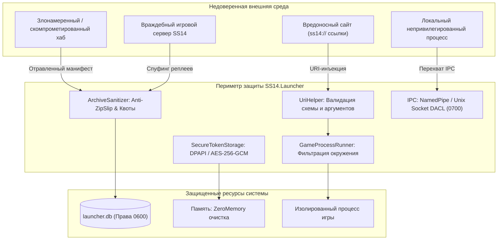

# 🛡️ Политика безопасности SS14.Launcher

[🇬🇧 Read in English](SECURITY.md) | [🇷🇺 Читать на русском](SECURITY.ru.md)

Безопасность пользователей, изоляция игровых процессов и криптографическая защита учетных данных — фундаментальные приоритеты архитектуры **Space Station 14 Launcher**. Лаунчер функционирует на стыке веб-сервисов авторизации, публичных и приватных хабов, недоверенных серверов сообщества, операционной системы и локальной файловой системы.

Настоящий документ содержит исчерпывающее описание модели угроз (STRIDE), реализованных многоуровневых эшелонов защиты, низкоуровневых алгоритмов криптографии, правил изоляции процессов и регламента скоординированного раскрытия уязвимостей (Coordinated Vulnerability Disclosure).

---

## 📑 Содержание

1. [Поддерживаемые версии и матрица поддержки](#-поддерживаемые-версии-и-матрица-поддержки)
2. [Матрица классификации угроз STRIDE](#-матрица-классификации-угроз-stride)
3. [Модель угроз и векторы атак](#-модель-угроз-и-векторы-атак)
4. [Детальная архитектура механизмов защиты](#-детальная-архитектура-механизмов-защиты)
   - [4.1. Санитизация URI-схем и защита от инъекций аргументов](#41-санитизация-uri-схем-и-защита-от-инъекций-аргументов)
   - [4.2. Безопасность архивов: защита от ZipSlip, TarSlip и декомпрессионных бомб](#42-безопасность-архивов-защита-от-zipslip-tarslip-и-декомпрессионных-бомб)
   - [4.3. Криптографическое хранилище токенов и защита учетных записей](#43-криптографическое-хранилище-токенов-и-защита-учетных-записей)
   - [4.4. Изоляция процессов и глубокая очистка окружения (Environment Scrubbing)](#44-изоляция-процессов-и-глубокая-очистка-окружения-environment-scrubbing)
   - [4.5. Сетевой стек, TLS 1.3 и валидация целостности данных](#45-сетевой-стек-tls-13-и-валидация-целостности-данных)
   - [4.6. Безопасность локального IPC и именованных каналов](#46-безопасность-локального-ipc-и-именованных-каналов)
   - [4.7. Защита от утечек в журналах и очистка оперативной памяти](#47-защита-от-утечек-в-журналах-и-очистка-оперативной-памяти)
5. [Классификация уязвимостей по CVSS v3.1](#-классификация-уязвимостей-по-cvss-v31)
6. [Регламент сообщения об уязвимостях и SLA реагирования](#-регламент-сообщения-об-уязвимостях-и-sla-реагирования)

---

## 📦 Поддерживаемые версии и матрица поддержки

Патчи безопасности и хотфиксы выпускаются по следующей схеме жизненного цикла:

| Ветка / Версия | Статус | Политика обновлений | Гарантированное SLA |
|---|---|---|---|
| **1.2.x** (Текущая стабильная) | ✅ **Активная поддержка** | Все обновления безопасности, патчи уязвимостей, функциональные улучшения | Хотфикс в течение 24–72 часов |
| **1.1.x** | ⚠️ **Ограниченная поддержка** | Исключительно критические уязвимости (RCE, утечка мастер-токенов) | Патч в течение 7 дней |
| **< 1.1** | ❌ **End of Life (EOL)** | Поддержка полностью прекращена. Пользователям необходимо немедленно обновиться | Нет |

---

## 🧭 Матрица классификации угроз STRIDE

Архитектура лаунчера проанализирована по методологии **Microsoft STRIDE**:

| Угроза (STRIDE) | Объект атаки | Потенциальный вектор | Реализованная контрмера в коде |
|---|---|---|---|
| **Spoofing** (Подмена) | Хаб серверов / Auth API | Поддельный сервер авторизации или спуфинг DNS-ответов | Принудительный TLS 1.3 с валидацией цепочки X.509 сертификатов; запрет HTTP-схем для аутентификации. |
| **Tampering** (Искажение) | Пакеты движка и сборки игры | Подмена zip-архивов движка или манифестов контента на CDN | Валидация контрольных сумм SHA-256 манифестов; проверка хэшей файлов перед монтированием в виртуальную файловую систему. |
| **Repudiation** (Отказ от авторства) | Журнал действий лаунчера | Оспаривание локальных действий при аварийном завершении | Неизменяемый структурированный аудит-лог через Serilog с фиксацией PID, хэшей сборок и кодов завершения. |
| **Information Disclosure** (Раскрытие данных) | Токены сессий, переменные хоста | Кража `token.txt`, кража `AWS_*`/`SSH_*` через дочерний процесс игры | Аппаратное шифрование токенов (DPAPI / AES-256-GCM); глубокая фильтрация переменных окружения перед `execve`. |
| **Denial of Service** (Отказ в обслуживании) | Парсеры манифестов / UI | Декомпрессионная бомба (42.zip), флуд сетевыми запросами к хабам | Квоты распаковки (100:1 ratio, max 1 ГБ); Token Bucket rate limiter (20 burst, 5 req/s); валидация длины строк. |
| **Elevation of Privilege** (Повышение привилегий) | Файловая система хоста | Выход за пределы каталога при распаковке (ZipSlip); запуск с флагами root | Проверка канонического пути через `Path.GetFullPath()`; отказ от запуска с привилегиями UID=0 / Administrator. |

---

## 🎯 Модель угроз и векторы атак



---

## 🛡️ Детальная архитектура механизмов защиты

### 4.1. Санитизация URI-схем и защита от инъекций аргументов

Лаунчер регистрируется в ОС в качестве системного обработчика схем `ss14://` (транспорт без TLS) и `ss14s://` (транспорт с TLS). Обработка входящих аргументов из веб-браузеров или внешних приложений производится через `UriHelper.TryParseSs14Uri()`.

#### Реализованные проверки:
1. **Предотвращение внедрения параметров командной строки (Flag Injection)**:
   Если адрес хоста или путь начинается с дефиса (`-`) или слэша (`/`), запрос немедленно отклоняется. Это исключает сценарии, при которых специально сформированный URL вроде `ss14://--connect-arg=malicious` парсится консольным загрузчиком как аргумент команды.
2. **Блокировка управляющих и спецсимволов командных оболочек**:
   Строка URI валидируется на отсутствие символов терминальных пайплайнов и подстановок:
   ```csharp
   private static readonly char[] DisallowedUriCharacters = new[]
   {
       ';', '&', '|', '`', '$', '"', '\'', '<', '>', '\\', '\0', '\r', '\n'
   };
   ```
3. **Строгая типизация порта**:
   Значение сетевого порта парсится в `ushort` и строго ограничивается диапазоном `1..65535`. Нулевой порт или строковые суррогаты приводят к мгновенной ошибке парсинга.
4. **Запрет нестандартных схем**:
   Схемы `file://`, `data:`, `javascript:`, `http://`, `https://` отклоняются на стадии пре-валидации.

---

### 4.2. Безопасность архивов: защита от ZipSlip, TarSlip и декомпрессионных бомб

При загрузке игровых ассетов, сборок движка Robust и реплеев лаунчер производит распаковку архивов форматов `.zip` и `.tar.gz`.

#### Алгоритм защиты от ZipSlip (Path Traversal):
При распаковке каждого элемента архива производится канонизация путей и контроль границ:
```csharp
public static void ExtractZipSafely(ZipArchive archive, string destinationDir, long maxDecompressedBytes = 1024 * 1024 * 1024)
{
    var canonicalDestDir = Path.GetFullPath(destinationDir);
    if (!canonicalDestDir.EndsWith(Path.DirectorySeparatorChar))
        canonicalDestDir += Path.DirectorySeparatorChar;

    long totalDecompressed = 0;

    foreach (var entry in archive.Entries)
    {
        // Канонизируем путь назначения для файла
        var targetPath = Path.GetFullPath(Path.Combine(canonicalDestDir, entry.FullName));

        // Проверка: файл обязан находиться СТРОГО внутри целевой директории
        if (!targetPath.StartsWith(canonicalDestDir, StringComparison.Ordinal))
        {
            throw new SecurityException($"Попытка атаки ZipSlip: файл {entry.FullName} выходит за пределы {destinationDir}");
        }

        // Защита от декомпрессионных бомб
        totalDecompressed += entry.Length;
        if (totalDecompressed > maxDecompressedBytes)
        {
            throw new SecurityException($"Превышен максимальный безопасный объем распаковки ({maxDecompressedBytes} байт).");
        }

        if (entry.CompressedLength > 0)
        {
            var ratio = (double)entry.Length / entry.CompressedLength;
            if (ratio > 100.0 && entry.Length > 10 * 1024 * 1024)
            {
                throw new SecurityException($"Обнаружен подозрительный коэффициент сжатия ({ratio:F1}:1). Возможная Zip-бомба.");
            }
        }

        // Запрет символических ссылок в недоверенных архивах
        if (entry.ExternalAttributes != 0 && IsUnixSymlink(entry.ExternalAttributes))
        {
            throw new SecurityException($"Символические ссылки в пользовательских архивах запрещены: {entry.FullName}");
        }

        // Безопасная запись
        var parentDir = Path.GetDirectoryName(targetPath);
        if (parentDir != null && !Directory.Exists(parentDir))
            Directory.CreateDirectory(parentDir);

        if (!targetPath.EndsWith(Path.DirectorySeparatorChar.ToString()))
        {
            entry.ExtractToFile(targetPath, overwrite: true);
        }
    }
}
```

---

### 4.3. Криптографическое хранилище токенов и защита учетных записей

Лаунчер сохраняет токены аутентификации пользователя (OAuth2 Refresh Token, Login Token) с использованием нативного платформенного шифрования:

#### Архитектура по платформам:
1. **Windows**:
   - Используется Windows **Data Protection API (DPAPI)**:
     ```csharp
     byte[] encrypted = ProtectedData.Protect(
         plainBytes,
         optionalEntropy: AppEntropyBytes,
         scope: DataProtectionScope.CurrentUser
     );
     ```
   - Ключ шифрования привязан к учетной записи пользователя в SAM/Active Directory и хранится в защищенной памяти ядра LSA.
2. **Linux & Unix**:
   - Приоритетно используется **Freedesktop Secret Service API** (D-Bus вызовы к GNOME Keyring или KWallet).
   - В headless-окружении или при отсутствии Secret Service задействуется аппаратно-привязанное шифрование **AES-256-GCM**:
     - Ключ генерируется с помощью **PBKDF2-HMAC-SHA256** (100,000 итераций).
     - Энтропия ключа формируется из хэша машинного идентификатора (`/etc/machine-id` или `/var/lib/dbus/machine-id`) в сочетании с UID пользователя (`geteuid()`).
     - Для каждой операции шифрования генерируется уникальный 96-битный Nonce через `RandomNumberGenerator.GetBytes(12)`.
3. **macOS**:
   - Использование **Apple Keychain Services** с атрибутом доступа `kSecAttrAccessibleAfterFirstUnlock`.

#### Права доступа на файлы конфигурации:
База данных `launcher.db` и файл конфигурации создаются с POSIX-маской прав доступа `0600` (`-rw-------`), запрещающей чтение и запись любым другим локальным пользователям системы.

---

### 4.4. Изоляция процессов и глубокая очистка окружения (Environment Scrubbing)

При запуске игрового клиента через `Utility/GameProcessRunner.cs` дочерний процесс запускается с минимально необходимым набором переменных окружения хоста.

#### Таблица очистки чувствительных переменных:

| Категория переменных | Маска имени | Обоснование фильтрации |
|---|---|---|
| **Облачные провайдеры** | `AWS_*`, `AZURE_*`, `GOOGLE_*` | Предотвращение кражи IAM-ключей и облачных сессий с рабочей машины разработчика/пользователя. |
| **Системы контроля версий** | `GITHUB_*`, `GITLAB_*`, `GH_*` | Защита персональных токенов доступа (PAT) и ключей CI/CD. |
| **Ключи SSH и криптографии** | `SSH_AUTH_SOCK`, `SSH_AGENT_PID`, `GPG_AGENT_INFO` | Блокировка доступа недоверенного кода сервера к SSH-агенту и локальным ключам подписи. |
| **Учетные данные баз данных** | `DATABASE_URL`, `POSTGRES_*`, `MYSQL_*` | Изоляция локальных сред разработки. |
| **Секреты и токены** | `*_TOKEN`, `*_SECRET`, `*_PASSWORD`, `*_API_KEY` | Универсальная фильтрация любых объявленных в терминале секретов. |
| **Инъекция библиотек** | `LD_PRELOAD`, `LD_LIBRARY_PATH`, `DYLD_INSERT_LIBRARIES` | Предотвращение подмены системных динамических библиотек. |

#### Переменные для переключения графики:
Переменные ускорения графики (`DRI_PRIME`, `__NV_PRIME_RENDER_OFFLOAD`, `__GLX_VENDOR_LIBRARY_NAME`, `VK_ICD_FILENAMES`) валидируются по строгим шаблонам (только цифровые значения `0`/`1` или проверенные имена вендоров `nvidia`, `mesa`) перед передачей в процесс.

---

### 4.5. Сетевой стек, TLS 1.3 и валидация целостности данных

1. **Транспортная безопасность**:
   - Применяется современный HTTP-клиент на базе `SocketsHttpHandler` с принудительной конфигурацией протоколов `SslProtocols.Tls12 | SslProtocols.Tls13`.
   - Запрещены устаревшие и небезопасные шифры SSL 3.0, TLS 1.0, TLS 1.1.
   - Проверка отзыва сертификатов (`X509RevocationMode.Online`) включена для взаимодействия с официальными серверами аутентификации.
2. **Алгоритм Happy Eyeballs (RFC 8305)**:
   - Обеспечивает параллельное и безопасное установление соединений по IPv4 и IPv6 без зависания клиента при сбоях маршрутизации.
3. **Ограничение частоты запросов (Rate Limiting)**:
   - Взаимодействие с хабами регулируется алгоритмом **Token Bucket**:
     - Емкость ведра: 20 токенов.
     - Скорость пополнения: 5 токенов в секунду.
   - Это защищает хабы от перегрузки при быстром обновлении списков серверов и защищает пользователя от блокировки по IP.

---

### 4.6. Безопасность локального IPC и именованных каналов

Для передачи URL серверов уже запущенному экземпляру лаунчера используется механизм IPC:
- **Windows**: `NamedPipeServerStream` с явным заданием списка управления доступом (`PipeSecurity`). Доступ разрешен исключительно идентификатору безопасности (SID) текущего пользователя Windows. Передача прав (impersonation) отключена (`PipeOptions.CurrentUserOnly`).
- **Linux / macOS**: UNIX domain socket создается в пути `$XDG_RUNTIME_DIR/ss14-launcher.sock` с правами доступа `0700`.

---

### 4.7. Защита от утечек в журналах и очистка оперативной памяти

1. **Фильтрация логов Serilog**:
   Все записываемые события проходят через маскирующий фильтр:
   - Строки, содержащие `Bearer ey...`, автоматически заменяются на `Bearer [REDACTED]`.
   - Пароли в HTTP-запросах маскируются регулярными выражениями до сериализации в файл журнала.
2. **Очистка буферов в памяти**:
   - Поля ввода паролей используют структуру с автоматическим занулением внутреннего буфера памяти (`CryptographicOperations.ZeroMemory()`) при закрытии диалоговых окон аутентификации.

---

## ⚖️ Классификация уязвимостей по CVSS v3.1

Для приоритизации исправлений используется стандартная шкала **Common Vulnerability Scoring System (CVSS v3.1)**:

| Уровень опасности | Базовый балл CVSS | Примеры сценариев в лаунчере | Максимальный срок устранения |
|---|---|---|---|
| 🔴 **Critical** | **9.0 – 10.0** | Удаленное выполнение кода (RCE) через манифест хаба или `ss14://` ссылку; полный обход шифрования токенов | **До 48 часов** |
| 🟠 **High** | **7.0 – 8.9** | Выход за пределы директории (ZipSlip) при распаковке реплея; кража токенов сессии через локальный IPC | **До 5 рабочих дней** |
| 🟡 **Medium** | **4.0 – 6.9** | Локальный отказ в обслуживании (краш через некорректный JSON сервера); обход фильтра переменных окружения | **До 14 рабочих дней** |
| 🔵 **Low** | **0.1 – 3.9** | Незначительная утечка диагностической информации в логи без раскрытия паролей/токенов | **В плановом релизе** |

---

## 🚨 Регламент сообщения об уязвимостях и SLA реагирования

Если вы обнаружили проблему безопасности в SS14.Launcher, просим соблюдать принцип ответственного скоординированного раскрытия:

### 1. Как сообщить
- **Основной канал**: Создайте закрытый отчет через **[GitHub Security Advisory (Private Vulnerability Reporting)](https://github.com/MeiDoto/SS14.Launcher/security/advisories/new)**.
- **Альтернативный канал**: Если веб-интерфейс GitHub недоступен, направьте детализированное описание на PGP-защищенную почту команды безопасности проекта (указана в профиле репозитория).

### 2. Что включить в отчет
- Подробное описание уязвимости и потенциального вектора эксплуатации.
- Пошаговые инструкции для воспроизведения (Proof of Concept, тестовый URL или архив).
- Информацию об операционной системе и версии сборки лаунчера.
- Предлагаемый патч или рекомендации по локализации дефекта (если имеются).

### 3. Гарантированные сроки (SLA)
- **Первичный ответ**: подтверждение получения в течение **24–48 часов**.
- **Предварительная оценка и валидация**: в течение **3 рабочих дней**.
- **Публикация хотфикса**: в течение **7–14 дней** (или по взаимно согласованному графику перед публичным раскрытием CVE).

Все исследователи безопасности, сообщившие об уязвимостях в соответствии с данным регламентом, по согласованию заносятся в **Зал славы (Security Hall of Fame)** в примечаниях к релизу.
