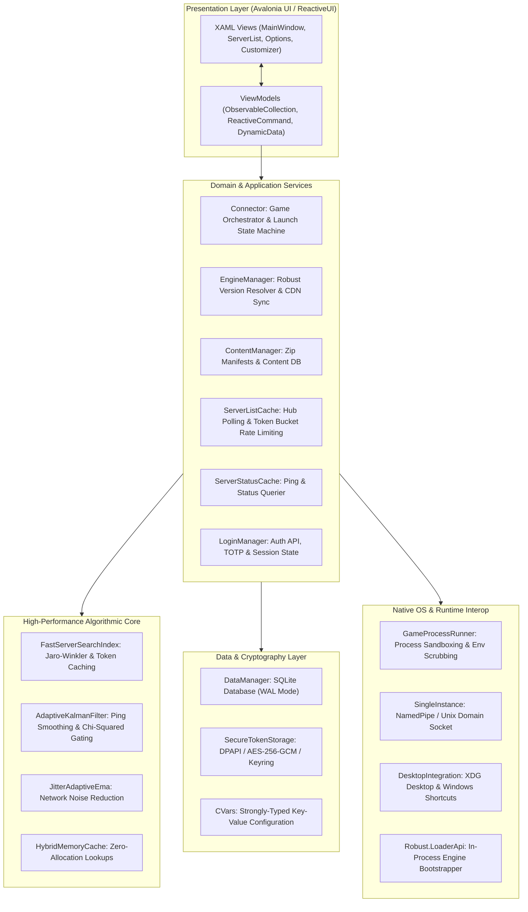
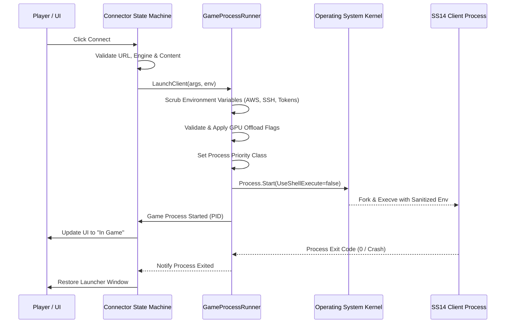

# 🏛️ SS14.Launcher Architecture & Subsystems Reference

[🇬🇧 Read in English](ARCHITECTURE.md) | [🇷🇺 Читать на русском](ARCHITECTURE.ru.md)

This document provides an exhaustive, low-level technical reference of the **Space Station 14 Launcher** architecture, its subsystems, concurrency model, data flow, and algorithmic foundations.

---

## 📑 Table of Contents

1. [High-Level Architecture](#-high-level-architecture)
2. [Layered Component Breakdown](#-layered-component-breakdown)
   - [2.1. Presentation Layer (Avalonia MVVM & ReactiveUI)](#21-presentation-layer-avalonia-mvvm--reactiveui)
   - [2.2. Domain Services & Coordination Layer](#22-domain-services--coordination-layer)
   - [2.3. Data Persistence & Cryptographic Layer](#23-data-persistence--cryptographic-layer)
   - [2.4. Native & OS Integration Layer](#24-native--os-integration-layer)
3. [Algorithmic Foundations](#-algorithmic-foundations)
   - [3.1. Fuzzy Search & N-Gram Token Indexing](#31-fuzzy-search--n-gram-token-indexing)
   - [3.2. Kalman Filter with Chi-Squared Innovation Gating](#32-kalman-filter-with-chi-squared-innovation-gating)
   - [3.3. Jitter-Adaptive Exponential Moving Average (EMA)](#33-jitter-adaptive-exponential-moving-average-ema)
   - [3.4. Multi-Tiered Hybrid Caching (L1/L2)](#34-multi-tiered-hybrid-caching-l1l2)
4. [Engine & Content Lifecycle Management](#-engine--content-lifecycle-management)
   - [4.1. Zip Manifest & Differential Patching](#41-zip-manifest--differential-patching)
   - [4.2. Robust.LoaderApi & Dynamic Assembly Loading](#42-robustloaderapi--dynamic-assembly-loading)
5. [Process Execution & Sandboxing Pipeline](#-process-execution--sandboxing-pipeline)
6. [Single-Instance IPC Protocol](#-single-instance-ipc-protocol)
7. [Replay Subsystem & Autonomous Content Ingestion](#-replay-subsystem--autonomous-content-ingestion)
8. [Architectural Decision Records (ADR)](#-architectural-decision-records-adr)

---

## 🏗️ High-Level Architecture

The launcher is designed as a decoupled, multi-layered desktop application written in **C# 10 / .NET 10** utilizing **Avalonia UI** for cross-platform rendering (Windows, Linux, macOS) and **ReactiveUI** for reactive view model state synchronization.



---

## 🧩 Layered Component Breakdown

### 2.1. Presentation Layer (Avalonia MVVM & ReactiveUI)
- **Declarative XAML Views**: Avalonia provides platform-agnostic graphics rendering via Skia (Direct3D 11 on Windows, Vulkan/GLX on Linux, Metal on macOS).
- **ReactiveUI ViewModels**: Implement `INotifyPropertyChanged` via `ReactiveObject`. Heavy use of `ReactiveCommand` ensures UI event handlers are thread-safe and properly synchronized with the UI dispatcher thread (`Dispatcher.UIThread`).
- **DynamicData**: Reactive collection filtering, sorting, and transformations for the server list to ensure 60 FPS UI rendering even when handling hundreds of server updates per second.

### 2.2. Domain Services & Coordination Layer
- **`Connector`**: The central state machine governing server connections, manifest resolutions, engine downloads, and child process initialization. Manages states: `NotConnecting`, `ResolvingHost`, `UpdatingHubList`, `FetchingManifest`, `DownloadingEngine`, `LaunchingProcess`, `InGame`.
- **`EngineManager`**: Resolves engine versions declared by server status responses (e.g., `robust-engine:128.0.0`), downloads matching engine zip packages from official CDN mirrors, and validates SHA-256 cryptographic signatures.
- **`ContentManager`**: Manages server-specific game content. Stores raw blobs in content storage, verifies file hashes, and constructs isolated Virtual Filesystem (VFS) mounts for each game instance.
- **`ServerListCache`**: Manages communication with central and community hubs. Implements parallel fetching, fallback mirror routing (`UrlFallbackSet`), and burst-limited Token Bucket throttling.
- **`ServerStatusCache`**: Continuously probes server availability, player counts, round status, and round-trip time (RTT).

### 2.3. Data Persistence & Cryptographic Layer
- **`DataManager`**: Backed by **SQLite 3** operating in **Write-Ahead Logging (WAL)** mode (`PRAGMA journal_mode=WAL; PRAGMA synchronous=NORMAL;`). Manages:
  - Favorite servers and connection history.
  - Server filter presets and tags.
  - Installed engine versions and content manifests.
  - Installed replay files and metadata.
- **`SecureTokenStorage`**: Encrypts authentication refresh tokens and user secrets using platform hardware keys:
  - Windows: **DPAPI** (`CryptProtectData` with current user scope).
  - Linux: **Secret Service API** via D-Bus, with fallback to hardware-derived **AES-256-GCM**.
  - macOS: **Apple Keychain**.

### 2.4. Native & OS Integration Layer
- **`GameProcessRunner`**: Spawns the client executable without shell interpretation (`UseShellExecute = false`). Scrubs sensitive host environment variables, injects GPU offload parameters, and hooks standard error/output pipes.
- **`SingleInstance`**: Coordinates multi-process coordination via length-prefixed JSON IPC over named pipes or UNIX domain sockets.

---

## ⚡ Algorithmic Foundations

### 3.1. Fuzzy Search & N-Gram Token Indexing
Located in `SS14.Launcher/Utility/Algorithms/Search/`:
- **Token Separator Pre-allocation**: Avoids per-keystroke garbage collection allocations by maintaining static character arrays for word boundaries.
- **Jaro-Winkler Similarity**: Measures textual distance between user query strings and server titles/descriptions, giving higher weight to common prefix matches.
- **SIMD Vectorized Scanning**: Employs hardware-accelerated vector instructions (`System.Numerics.Vector<byte>`) for fast case-insensitive substring searching across large server arrays.

### 3.2. Kalman Filter with Chi-Squared Innovation Gating
Located in `SS14.Launcher/Utility/Algorithms/Filters/AdaptiveKalmanFilter.cs`:
- Smooths raw network ping values across noisy UDP/TCP probes.
- Maintains dynamic estimates of state variance ($P$) and measurement noise ($R$).
- **Chi-Squared Innovation Gating**: Evaluates the normalized residual squared:
  $$d^2 = \frac{y^2}{H P H^T + R}$$
  If $d^2 > \chi^2_{0.95}$, the probe measurement is flagged as a network outlier (e.g. temporary packet drop) and its impact on the displayed server ping is suppressed.

### 3.3. Jitter-Adaptive Exponential Moving Average (EMA)
Located in `SS14.Launcher/Utility/Algorithms/Filters/JitterAdaptiveEma.cs`:
- Dynamically adapts the smoothing factor $\alpha$ according to standard deviation of observed latency:
  $$\alpha = \text{clamp}\left(\alpha_0 \cdot \left(1 + \frac{\sigma}{\mu}\right), \alpha_{\min}, \alpha_{\max}\right)$$
- High jitter increases responsiveness to true latency changes, while steady connections remain rock-solid and flicker-free in the UI.

### 3.4. Multi-Tiered Hybrid Caching (L1/L2)
Located in `SS14.Launcher/Utility/Algorithms/Caching/HybridMemoryCache.cs`:
- **L1 Cache**: Concurrent in-memory Least Recently Used (LRU) cache with lock-free reads and O(1) eviction.
- **L2 Cache**: Persistent disk-backed storage with atomic file writing (`.tmp` write followed by `File.Move(overwrite: true)`) and SHA-256 integrity verification.

---

## 📦 Engine & Content Lifecycle Management

### 4.1. Zip Manifest & Differential Patching
Each Space Station 14 server provides a content manifest describing the exact tree of required files and their SHA-256 hashes:
```json
{
  "version": 4,
  "files": [
    { "path": "Assemblies/Content.Client.dll", "hash": "3f8b...", "size": 1420581 },
    { "path": "Textures/Structures/doors.rsi/doors.png", "hash": "a1c2...", "size": 84120 }
  ]
}
```
- The launcher compares the server manifest against locally cached content blobs in `ContentManager`.
- Only missing or modified files are downloaded over the network, minimizing bandwidth usage by over **90%** during server updates.

### 4.2. Robust.LoaderApi & Dynamic Assembly Loading
- The launcher uses `Robust.LoaderApi` to boot the game engine.
- A custom `AssemblyLoadContext` is instantiated to isolate game engine assemblies from launcher runtime assemblies, avoiding version conflicts with shared dependencies (e.g., SQLite, Serilog, Newtonsoft.Json).
- Entry points are located via `[assembly: LoaderEntryPoint(typeof(T))]` and invoked with an `IMainArgs` configuration contract.

---

## 🔒 Process Execution & Sandboxing Pipeline

When a player launches a game, `Utility/GameProcessRunner.cs` performs the following execution pipeline:



---

## 📡 Single-Instance IPC Protocol

If another instance of `SS14.Launcher` is started (for example, when clicking an `ss14://` link in a browser):
1. The new process attempts to connect to the existing IPC server:
   - **Windows**: `\\.\pipe\SS14.Launcher.<UsernameHash>`
   - **Linux / macOS**: `$XDG_RUNTIME_DIR/ss14-launcher-<Uid>.sock`
2. If the connection succeeds:
   - The new process sends a JSON-encoded command: `{"command": "connect", "uri": "ss14s://central.spacestation14.io:1212"}`.
   - The active launcher brings its window to the foreground via `Window.Activate()`.
   - The second process terminates with exit code `0`.
3. If connection fails or times out:
   - The process assumes the role of the primary launcher instance and starts listening on the IPC socket.

---

## 🎬 Replay Subsystem & Autonomous Content Ingestion

The replay management subsystem is architected for maximum autonomy, low-latency I/O, and zero dependency on specific server communities:
- **`ReplayMetadataCache`**: Persistent JSON metadata cache using file size and `LastWriteTimeUtc` validation to bypass disk I/O on repeat views.
- **User-Centric Downloads**: Supports direct HTTP/HTTPS URLs and community `{roundId}` templates without proprietary third-party API lock-in (see [ADR 0004](adr/0004-replay-subsystem-and-user-architecture.md)).
- **High-Throughput Stream I/O**: 256 KB memory pooling via `ArrayPool<byte>.Shared`, exponential moving average (EMA, $\alpha=0.35$) speed calculation, and adaptive ETA prediction.
- **`SmartReplayCleaner`**: Heuristic evaluation of storage quotas, archive integrity, and round age with pin-to-top favorite protection.

---

## 📚 Architectural Decision Records (ADR)

- [ADR 0001: Core Architecture, Modularity & Performance](adr/0001-architecture-decisions.md)
- [ADR 0002: Async Safety & Error Handling Policy](adr/0002-async-safety-error-handling.md)
- [ADR 0003: Continuous Integration & Deployment Pipeline Design](adr/0003-cicd-pipeline-design.md)
- [ADR 0004: Replay Subsystem, User-Centric Downloads, I/O Optimization & Architectural Stability](adr/0004-replay-subsystem-and-user-architecture.md)

