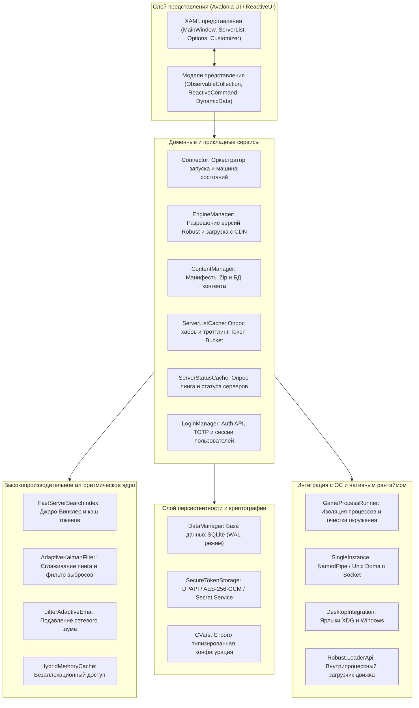
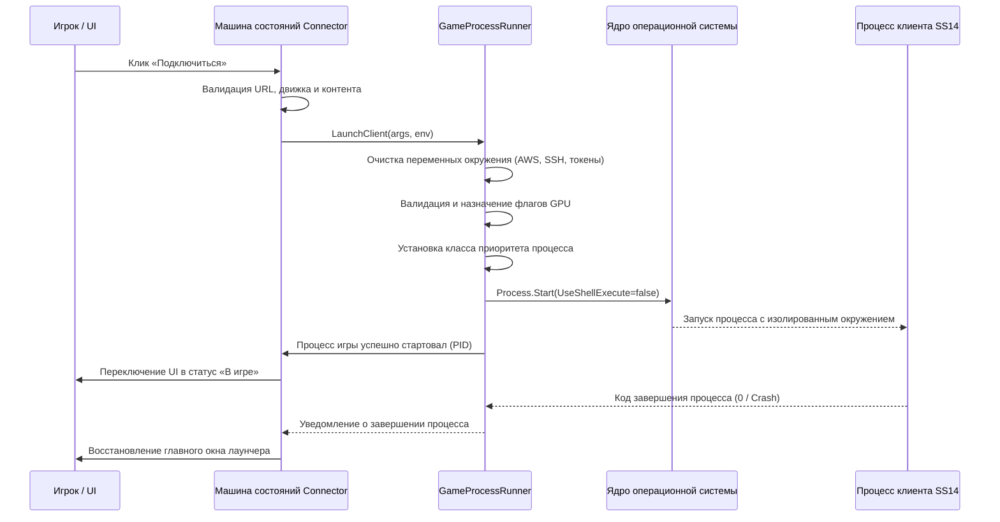

# 🏛️ Архитектура и подсистемы SS14.Launcher

[🇬🇧 Read in English](ARCHITECTURE.md) | [🇷🇺 Читать на русском](ARCHITECTURE.ru.md)

В данном документе представлено исчерпывающее низкоуровневое техническое описание архитектуры **Space Station 14 Launcher**, его подсистем, модели многопоточности, потоков данных и алгоритмического фундамента.

---

## 📑 Содержание

1. [Высокоуровневая архитектура](#-высокоуровневая-архитектура)
2. [Декомпозиция слоев архитектуры](#-декомпозиция-слоев-архитектуры)
   - [2.1. Слой представления (Avalonia MVVM & ReactiveUI)](#21-слой-представления-avalonia-mvvm--reactiveui)
   - [2.2. Слой доменных сервисов и координации](#22-слой-доменных-сервисов-и-координации)
   - [2.3. Слой сохранения данных и криптографии](#23-слой-сохранения-данных-и-криптографии)
   - [2.4. Слой взаимодействия с операционной системой](#24-слой-взаимодействия-с-операционной-системой)
3. [Алгоритмический фундамент](#-алгоритмический-фундамент)
   - [3.1. Нечеткий поиск и индексация N-грамм](#31-нечеткий-поиск-и-индексация-n-грамм)
   - [3.2. Фильтр Калмана с гейтингом невязок хи-квадрат](#32-фильтр-калмана-с-гейтингом-невязок-хи-квадрат)
   - [3.3. Экспоненциальное скользящее среднее (EMA) с адаптацией к джиттеру](#33-экспоненциальное-скользящее-среднее-ema-с-адаптацией-к-джиттеру)
   - [3.4. Многоуровневое гибридное кэширование (L1/L2)](#34-многоуровневое-гибридное-кэширование-l1l2)
4. [Управление жизненным циклом движка и контента](#-управление-жизненным-циклом-движка-и-контента)
   - [4.1. Манифесты Zip и дифференциальное обновление](#41-манифесты-zip-и-дифференциальное-обновление)
   - [4.2. Robust.LoaderApi и динамическая загрузка сборок](#42-robustloaderapi-и-динамическая-загрузка-сборок)
5. [Пайплайн запуска и изоляции процессов](#-пайплайн-запуска-и-изоляции-процессов)
6. [Протокол межпроцессного взаимодействия (Single-Instance IPC)](#-протокол-межпроцессного-взаимодействия-single-instance-ipc)

---

## 🏗️ Высокоуровневая архитектура

Лаунчер спроектирован как модульное многоуровневое десктопное приложение на платформе **C# 10 / .NET 10**, использующее графический фреймворк **Avalonia UI** для кроссплатформенного рендеринга (Windows, Linux, macOS) и библиотеку **ReactiveUI** для реактивной синхронизации состояния моделей представления.



---

## 🧩 Декомпозиция слоев архитектуры

### 2.1. Слой представления (Avalonia MVVM & ReactiveUI)
- **Декларативные представления XAML**: Рендеринг через Skia (Direct3D 11 на Windows, Vulkan/GLX на Linux, Metal на macOS).
- **Реактивные модели представления (ReactiveUI)**: Реализуют интерфейс `INotifyPropertyChanged` через `ReactiveObject`. Все команды `ReactiveCommand` гарантируют потокобезопасность и исполнение обновлений UI строго в главном потоке графической подсистемы (`Dispatcher.UIThread`).
- **Библиотека DynamicData**: Высокопроизводительная реактивная фильтрация, сортировка и преобразование списка серверов, гарантирующая стабильные 60 кадров в секунду даже при сотнях сетевых обновлений в секунду.

### 2.2. Слой доменных сервисов и координации
- **`Connector`**: Главный конечный автомат, управляющий процессом подключения, валидацией манифестов, загрузкой бинарников движка и стартом процесса игры. Состояния: `NotConnecting`, `ResolvingHost`, `UpdatingHubList`, `FetchingManifest`, `DownloadingEngine`, `LaunchingProcess`, `InGame`.
- **`EngineManager`**: Анализирует версии движка, запрошенные сервером (например, `robust-engine:128.0.0`), скачивает соответствующие zip-пакеты с официальных зеркал CDN и проверяет криптографические контрольные суммы SHA-256.
- **`ContentManager`**: Обеспечивает хранение контента серверов (текстуры, звуки, скрипты, сборки). Проверяет целостность файлов и формирует виртуальную файловую систему (VFS) для каждого игрового сервера.
- **`ServerListCache`**: Управляет сетевыми запросами к центральным и пользовательским хабам. Поддерживает балансировку по зеркалам (`UrlFallbackSet`) и защиту от перегрузки алгоритмом Token Bucket.
- **`ServerStatusCache`**: Фоновый опрос доступности серверов, количества игроков, текущего раунда и времени задержки (RTT).

### 2.3. Слой сохранения данных и криптографии
- **`DataManager`**: Работает поверх локальной **SQLite 3** в режиме **Write-Ahead Logging (WAL)** (`PRAGMA journal_mode=WAL; PRAGMA synchronous=NORMAL;`). Хранит:
  - Избранные серверы и историю подключений.
  - Пресеты и теги фильтрации серверов.
  - Кэш установленных версий движка и манифестов.
  - Историю и метаданные сохраненных реплеев.
- **`SecureTokenStorage`**: Шифрует токены авторизации пользователей с помощью аппаратных механизмов ОС:
  - Windows: **DPAPI** (`CryptProtectData` с областью текущего пользователя).
  - Linux: **Secret Service API** через D-Bus, либо аппаратное **AES-256-GCM** на основе уникального ID машины.
  - macOS: **Apple Keychain**.

### 2.4. Слой взаимодействия с операционной системой
- **`GameProcessRunner`**: Запускает исполняемый файл клиента напрямую (`UseShellExecute = false`). Удаляет чувствительные переменные окружения хоста, передает флаги ускорения дискретного GPU и подключает пайплайны логирования.
- **`SingleInstance`**: Обеспечивает работу единственного экземпляра лаунчера, передавая внешние вызовы через Named Pipes (Windows) или UNIX Domain Socket (Linux).

---

## ⚡ Алгоритмический фундамент

### 3.1. Нечеткий поиск и индексация N-грамм
Реализовано в `SS14.Launcher/Utility/Algorithms/Search/`:
- **Кэширование разделителей токенов**: Статические массивы символов границ слов исключают нагрузку на сборщик мусора (GC) при быстром вводе поискового запроса.
- **Сходство Джаро-Винклера**: Алгоритм текстового расстояния между поисковым запросом и названиями/описаниями серверов с повышенным весом совпадений в начале строк.
- **Векторизованное сканирование SIMD**: Применение векторных процессорных инструкций (`System.Numerics.Vector<byte>`) для ускоренного регистронезависимого поиска подстрок в больших массивах данных.

### 3.2. Фильтр Калмана с гейтингом невязок хи-квадрат
Реализовано в `SS14.Launcher/Utility/Algorithms/Filters/AdaptiveKalmanFilter.cs`:
- Производит оптимальное сглаживание сетевого пинга при нестабильных сетевых замерах.
- Непрерывно обновляет дисперсию состояния ($P$) и ковариацию шума измерений ($R$).
- **Гейтинг хи-квадрат**: Вычисляет нормализованный квадрат невязки:
  $$d^2 = \frac{y^2}{H P H^T + R}$$
  Если $d^2 > \chi^2_{0.95}$, замер считается аномальным сетевым выбросом (например, кратковременной потерей пакета) и отсекается, предотвращая дергание индикатора в интерфейсе.

### 3.3. Экспоненциальное скользящее среднее (EMA) с адаптацией к джиттеру
Реализовано в `SS14.Launcher/Utility/Algorithms/Filters/JitterAdaptiveEma.cs`:
- Динамически корректирует коэффициент сглаживания $\alpha$ в зависимости от стандартного отклонения задержки:
  $$\alpha = \text{clamp}\left(\alpha_0 \cdot \left(1 + \frac{\sigma}{\mu}\right), \alpha_{\min}, \alpha_{\max}\right)$$
- При сильном джиттере возрастает чувствительность к реальным изменениям задержки, а на стабильных каналах пинг отображается ровно и без мерцания.

### 3.4. Многоуровневое гибридное кэширование (L1/L2)
Реализовано в `SS14.Launcher/Utility/Algorithms/Caching/HybridMemoryCache.cs`:
- **L1 Кэш**: Потокобезопасный in-memory кэш с политикой вытеснения LRU (наименее востребованные данные) и чтением со сложностью $O(1)$.
- **L2 Кэш**: Дисковое хранилище с атомарной записью файлов (запись во временный файл `.tmp` с последующим атомарным вызовом `File.Move(overwrite: true)`) и контролем целостности по хэшам SHA-256.

---

## 📦 Управление жизненным циклом движка и контента

### 4.1. Манифесты Zip и дифференциальное обновление
Серверы Space Station 14 предоставляют манифест контента, содержащий список всех файлов сборки с их хэшами SHA-256:
```json
{
  "version": 4,
  "files": [
    { "path": "Assemblies/Content.Client.dll", "hash": "3f8b...", "size": 1420581 },
    { "path": "Textures/Structures/doors.rsi/doors.png", "hash": "a1c2...", "size": 84120 }
  ]
}
```
- Лаунчер сверяет серверный манифест с локально закэшированными блобами в `ContentManager`.
- Через сеть загружаются исключительно недостающие или измененные файлы, что экономит свыше **90% сетевого трафика** при регулярных обновлениях игровых серверов.

### 4.2. Robust.LoaderApi и динамическая загрузка сборок
- Запуск движка игры осуществляется через контракт `Robust.LoaderApi`.
- Создается изолированный `AssemblyLoadContext`, исключающий конфликты версий библиотек между лаунчером и игровым клиентом (например, SQLite, Serilog, Newtonsoft.Json).
- Точка входа определяется через атрибут `[assembly: LoaderEntryPoint(typeof(T))]` и вызывается с передачей параметров `IMainArgs`.

---

## 🔒 Пайплайн запуска и изоляции процессов

При клике на подключение к серверу модуль `Utility/GameProcessRunner.cs` исполняет следующий пайплайн:



---

## 📡 Протокол межпроцессного взаимодействия (Single-Instance IPC)

Если пользователь запускает второй экземпляр `SS14.Launcher` (например, при клике по ссылке `ss14://` в веб-браузере):
1. Новый процесс пытается подключиться к каналу существующего экземпляра:
   - **Windows**: `\\.\pipe\SS14.Launcher.<UsernameHash>`
   - **Linux / macOS**: `$XDG_RUNTIME_DIR/ss14-launcher-<Uid>.sock`
2. При успешном соединении:
   - Процесс передает команду в формате JSON: `{"command": "connect", "uri": "ss14s://central.spacestation14.io:1212"}`.
   - Главное окно первого лаунчера разворачивается поверх окон через `Window.Activate()`.
   - Второй процесс немедленно завершается с кодом `0`.
3. При отсутствии запущенного экземпляра процесс сам становится первичным сервером IPC и открывает сокет для прослушивания.
