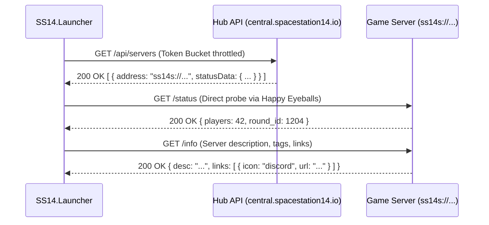

# 🌐 SS14.Launcher Networking & Protocol Specifications

[🇬🇧 Read in English](NETWORKING.md) | [🇷🇺 Читать на русском](NETWORKING.ru.md)

This document provides a low-level specification of all network communication channels, protocols, endpoints, and traffic throttling strategies utilized by **Space Station 14 Launcher**.

---

## 📑 Table of Contents

1. [Central & Community Hub Protocols](#-central--community-hub-protocols)
   - [1.1. Hub Advertisement & Polling Endpoints](#11-hub-advertisement--polling-endpoints)
   - [1.2. Fallback Mirror Strategy (UrlFallbackSet)](#12-fallback-mirror-strategy-urlfallbackset)
2. [Game Server Status & Info Protocols](#-game-server-status--info-protocols)
   - [2.1. Server Status Schema (`/status`)](#21-server-status-schema-status)
   - [2.2. Extended Info Schema (`/info`)](#22-extended-info-schema-info)
3. [Authentication API & Session Lifecycle](#-authentication-api--session-lifecycle)
   - [3.1. Authentication Flow](#31-authentication-flow)
   - [3.2. Session Token Refreshing](#32-session-token-refreshing)
   - [3.3. Multi-Factor Authentication (TOTP)](#33-multi-factor-authentication-totp)
4. [Dual-Stack Happy Eyeballs (RFC 8305)](#-dual-stack-happy-eyeballs-rfc-8305)
5. [Rate Limiting & Traffic Regulation](#-rate-limiting--traffic-regulation)
   - [5.1. Token Bucket Rate Limiter](#51-token-bucket-rate-limiter)
   - [5.2. Exponential Backoff with Full Jitter](#52-exponential-backoff-with-full-jitter)

---

## 🛰️ Central & Community Hub Protocols

Hubs are directory services that aggregate and advertise active Space Station 14 servers.



### 1.1. Hub Advertisement & Polling Endpoints

- **Endpoint**: `GET /api/servers`
- **Headers**:
  - `User-Agent`: `SS14.Launcher/v<Version> (<Platform>)`
  - `Accept`: `application/json`
- **Response Format**:
```json
[
  {
    "address": "ss14s://game.example.com:1212",
    "statusData": {
      "name": "Frontier Station 14",
      "players": 65,
      "soft_max_players": 80,
      "round_id": 1420
    }
  }
]
```

### 1.2. Fallback Mirror Strategy (UrlFallbackSet)
To ensure resilience against CDN outages or regional censorship, hub queries utilize `UrlFallbackSet`:
- Primary URL: `https://central.spacestation14.io/hub/api/servers`
- Fallback Mirrors: configured secondary mirrors (e.g. `https://hub.spacestation14.com/api/servers`).
- If the primary endpoint fails with a network exception or HTTP `5xx`, the client automatically retries on the next mirror within **1.5 seconds**, marking the faulty mirror as degraded for a cooldown period of 5 minutes.

---

## 📡 Game Server Status & Info Protocols

### 2.1. Server Status Schema (`/status`)
Probed directly by `ServerStatusCache` to assess latency, player capacity, and round progress:

- **Method**: `GET /status`
- **Response Schema**:
```json
{
  "name": "Official US West",
  "players": 34,
  "soft_max_players": 50,
  "round_id": 8921,
  "round_start_time": "2026-09-08T10:30:00Z",
  "panic_bunker": false,
  "run_level": 2
}
```
- `run_level`: `0` = InLobby, `1` = PreRoundLobby, `2` = InRound, `3` = PostRound.

### 2.2. Extended Info Schema (`/info`)
Fetched on demand when a user selects a server in the server list:

- **Method**: `GET /info`
- **Response Schema**:
```json
{
  "connect_address": "ss14s://us-west.spacestation14.io:1212",
  "auth": {
    "mode": "Optional",
    "public_key": "MIIBIjANBgkqhkiG9w0BAQEFAAOCAQ8AMIIBCgKCAQEA..."
  },
  "desc": "Official US West Community Server running the latest master branch.",
  "links": [
    { "name": "Discord", "icon": "discord", "url": "https://discord.gg/example" },
    { "name": "Wiki", "icon": "wiki", "url": "https://wiki.example.com" }
  ],
  "build": {
    "engine_version": "128.0.0",
    "fork_id": "upstream",
    "version": "2026.09.08.1",
    "download_url": "https://cdn.example.com/build.zip",
    "manifest_url": "https://cdn.example.com/manifest.json",
    "manifest_hash": "e3b0c44298fc1c149afbf4c8996fb92427ae41e4649b934ca495991b7852b855"
  }
}
```

---

## 🔐 Authentication API & Session Lifecycle

The launcher communicates with the Space Station 14 Central Auth API (`https://central.spacestation14.io/auth/`).

### 3.1. Authentication Flow
1. **User Login**:
   - `POST /api/auth/authenticate`
   - Payload: `{"username": "<Login>", "password": "<Password>"}`
   - Response: `{"token": "<AccessToken>", "expireTime": "...", "userId": "..."}`
2. **Guest Mode**:
   - If guest mode is selected, an ephemeral hardware-bound identity is generated locally without contacting the auth server.

### 3.2. Session Token Refreshing
- Tokens have a finite lifetime (typically 30 days).
- When a token approaches expiration or receives an HTTP `401 Unauthorized` during game handshake, `LoginManager` transparently issues:
  - `POST /api/auth/refresh` with the encrypted refresh token.
  - Stores the newly issued token securely in `SecureTokenStorage`.

### 3.3. Multi-Factor Authentication (TOTP)
- If TOTP 2FA is active on the account, the auth server returns status `200` with `requireTwoFactor: true`.
- The launcher prompts the user for the 6-digit TOTP code and resubmits to `/api/auth/authenticate/totp`.

---

## ⚡ Dual-Stack Happy Eyeballs (RFC 8305)

To prevent connection lag when contacting dual-stack servers (IPv4 and IPv6):
1. **Parallel DNS Resolution**: Resolves both `A` and `AAAA` records concurrently via `Dns.GetHostAddressesAsync()`.
2. **Connection Racing**:
   - Initiates connection to the IPv6 address first.
   - If the IPv6 handshake does not establish within **250 ms** (`ConnectionAttemptDelay`), a parallel connection attempt begins against the IPv4 address.
3. **Winner Takes All**: The first socket connection that successfully establishes TLS becomes the active transport; the remaining socket is cancelled and cleanly disposed.

---

## 🚦 Rate Limiting & Traffic Regulation

### 5.1. Token Bucket Rate Limiter
To prevent server and hub overload:
- **Bucket Capacity**: 20 tokens.
- **Refill Rate**: 5 tokens per second.
- Any request requiring a token when the bucket is empty is queued and delayed asynchronously using `Task.Delay` rather than blocking worker threads.

### 5.2. Exponential Backoff with Full Jitter
When a hub or game server returns HTTP `429 Too Many Requests` or network timeouts, the retry delay is calculated as:
$$T_{\text{wait}} = \text{random}\left(0, \min(T_{\max}, T_{\text{base}} \cdot 2^{\text{attempt}})\right)$$
Where $T_{\text{base}} = 500\text{ ms}$ and $T_{\max} = 10\,000\text{ ms}$. Full jitter decorrelates retry storms from hundreds of concurrent launcher clients.
