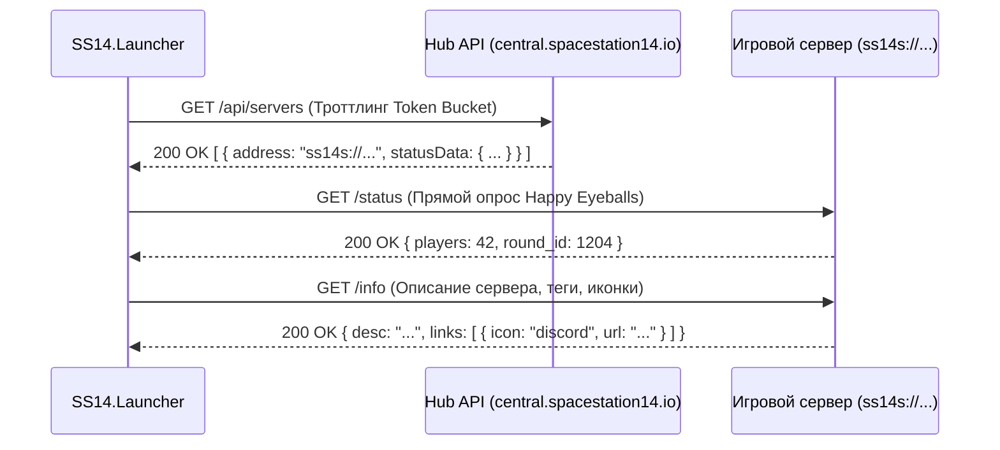

# 🌐 Сетевые протоколы и спецификация API в SS14.Launcher

[🇬🇧 Read in English](NETWORKING.md) | [🇷🇺 Читать на русском](NETWORKING.ru.md)

В данном документе приведена детальная спецификация всех сетевых каналов связи, протоколов, форматов данных и механизмов регулирования трафика, используемых в **Space Station 14 Launcher**.

---

## 📑 Содержание

1. [Протоколы взаимодействия с хабами серверов](#-протоколы-взаимодействия-с-хабами-серверов)
   - [1.1. Конечные точки опроса и агрегации серверов](#11-конечные-точки-опроса-и-агрегации-серверов)
   - [1.2. Стратегия переключения зеркал (UrlFallbackSet)](#12-стратегия-переключения-зеркал-urlfallbackset)
2. [Протоколы опроса игровых серверов](#-протоколы-опроса-игровых-серверов)
   - [2.1. Схема быстрого статуса (`/status`)](#21-схема-быстрого-статуса-status)
   - [2.2. Расширенная информация о сервере (`/info`)](#22-расширенная-информация-о-сервере-info)
3. [API аутентификации и управление сессиями](#-api-аутентификации-и-управление-сессиями)
   - [3.1. Жизненный цикл входа в аккаунт](#31-жизненный-цикл-входа-в-аккаунт)
   - [3.2. Автоматическое обновление токенов](#32-автоматическое-обновление-токенов)
   - [3.3. Двухфакторная аутентификация (TOTP)](#33-двухфакторная-аутентификация-totp)
4. [Алгоритм Happy Eyeballs для Dual-Stack IPv4/IPv6 (RFC 8305)](#-алгоритм-happy-eyeballs-для-dual-stack-ipv4ipv6-rfc-8305)
5. [Регулирование трафика и защита от перегрузок](#-регулирование-трафика-и-защита-от-перегрузок)
   - [5.1. Алгоритм Token Bucket](#51-алгоритм-token-bucket)
   - [5.2. Экспоненциальная задержка с полным джиттером (Full Jitter)](#52-экспоненциальная-задержка-с-полным-джиттером-full-jitter)

---

## 🛰️ Протоколы взаимодействия с хабами серверов

Хабы представляют собой каталоги, агрегирующие информацию обо всех доступных серверах Space Station 14.



### 1.1. Конечные точки опроса и агрегации серверов

- **Конечная точка**: `GET /api/servers`
- **Заголовки**:
  - `User-Agent`: `SS14.Launcher/v<Version> (<Platform>)`
  - `Accept`: `application/json`
- **Формат ответа**:
```json
[
  {
    "address": "ss14s://game.example.com:1212",
    "statusData": {
      "name": "Frontier Station 14",
      "players": 65,
      "soft_max_players": 80,
      "round_id": 1420
    }
  }
]
```

### 1.2. Стратегия переключения зеркал (UrlFallbackSet)
Для обеспечения устойчивости к сбоям сетей CDN или региональным блокировкам запросы к хабам проходят через `UrlFallbackSet`:
- Основной URL: `https://central.spacestation14.io/hub/api/servers`
- Резервные зеркала: сконфигурированные вторичные адреса.
- При возникновении таймаута или ошибки HTTP `5xx` лаунчер автоматически переключается на следующее зеркало в течение **1.5 секунд**, переводя отказавший адрес в режим ожидания (cooldown) на 5 минут.

---

## 📡 Протоколы опроса игровых серверов

### 2.1. Схема быстрого статуса (`/status`)
Опрашивается сервисом `ServerStatusCache` для измерения сетевой задержки (RTT), количества игроков и прогресса раунда:

- **Метод**: `GET /status`
- **Схема ответа**:
```json
{
  "name": "Official US West",
  "players": 34,
  "soft_max_players": 50,
  "round_id": 8921,
  "round_start_time": "2026-09-08T10:30:00Z",
  "panic_bunker": false,
  "run_level": 2
}
```
- `run_level`: `0` = В лобби, `1` = Подготовка к раунду, `2` = Идет раунд, `3` = Завершение раунда.

### 2.2. Расширенная информация о сервере (`/info`)
Загружается по требованию при выборе сервера в интерфейсе:

- **Метод**: `GET /info`
- **Схема ответа**:
```json
{
  "connect_address": "ss14s://us-west.spacestation14.io:1212",
  "auth": {
    "mode": "Optional",
    "public_key": "MIIBIjANBgkqhkiG9w0BAQEFAAOCAQ8AMIIBCgKCAQEA..."
  },
  "desc": "Официальный сервер сообщества, работающий на ветке master.",
  "links": [
    { "name": "Discord", "icon": "discord", "url": "https://discord.gg/example" },
    { "name": "Wiki", "icon": "wiki", "url": "https://wiki.example.com" }
  ],
  "build": {
    "engine_version": "128.0.0",
    "fork_id": "upstream",
    "version": "2026.09.08.1",
    "download_url": "https://cdn.example.com/build.zip",
    "manifest_url": "https://cdn.example.com/manifest.json",
    "manifest_hash": "e3b0c44298fc1c149afbf4c8996fb92427ae41e4649b934ca495991b7852b855"
  }
}
```

---

## 🔐 API аутентификации и управление сессиями

Лаунчер взаимодействует с официальным сервером авторизации (`https://central.spacestation14.io/auth/`).

### 3.1. Жизненный цикл входа в аккаунт
1. **Авторизация пользователя**:
   - `POST /api/auth/authenticate`
   - Тело запроса: `{"username": "<Login>", "password": "<Password>"}`
   - Ответ: `{"token": "<AccessToken>", "expireTime": "...", "userId": "..."}`
2. **Гостевой режим**:
   - При выборе гостевого режима лаунчер локально генерирует временный аппаратный идентификатор без отправки запроса на сервер авторизации.

### 3.2. Автоматическое обновление токенов
- Токены доступа имеют ограниченный срок действия (обычно 30 дней).
- При приближении срока истечения или при получении ошибки `401 Unauthorized` модуль `LoginManager` прозрачно производит:
  - `POST /api/auth/refresh` с передачей зашифрованного токена обновления.
  - Сохранение полученного нового токена в защищенном хранилище `SecureTokenStorage`.

### 3.3. Двухфакторная аутентификация (TOTP)
- Если на учетной записи включена двухфакторная аутентификация, сервер возвращает статус `200` с флагом `requireTwoFactor: true`.
- Лаунчер запрашивает у пользователя 6-значный код TOTP из приложения-аутентификатора и отправляет его на `/api/auth/authenticate/totp`.

---

## ⚡ Алгоритм Happy Eyeballs для Dual-Stack IPv4/IPv6 (RFC 8305)

Для минимизации задержек подключения к серверам с поддержкой обоих протоколов (IPv4 и IPv6):
1. **Параллельный DNS-запрос**: Одновременный запрос записей `A` и `AAAA` через `Dns.GetHostAddressesAsync()`.
2. **Гонка сокетов (Connection Racing)**:
   - В первую очередь инициируется соединение по протоколу IPv6.
   - Если за **250 миллисекунд** (`ConnectionAttemptDelay`) соединение IPv6 не установилось, параллельно запускается подключение по IPv4.
3. **Победа первого успешного**: Первый сокет, успешно завершивший TLS-рукопожатие, становится рабочим транспортом; второй сокет немедленно прерывается и освобождает системные дескрипторы.

---

## 🚦 Регулирование трафика и защита от перегрузок

### 5.1. Алгоритм Token Bucket
Для предотвращения случайных DDoS-атак на хабы и серверы:
- **Емкость ведра**: 20 токенов.
- **Скорость генерации**: 5 токенов в секунду.
- Запросы, приходящие при пустом ведре токенов, асинхронно ставятся в очередь с помощью `Task.Delay`, не блокируя потоки пула .NET.

### 5.2. Экспоненциальная задержка с полным джиттером (Full Jitter)
При получении ошибки `429 Too Many Requests` задержка повторной попытки вычисляется по формуле:
$$T_{\text{wait}} = \text{random}\left(0, \min(T_{\max}, T_{\text{base}} \cdot 2^{\text{attempt}})\right)$$
Где $T_{\text{base}} = 500\text{ мс}$, а $T_{\max} = 10\,000\text{ мс}$. Внесение случайной составляющей (джиттера) исключает резонансные пики повторных запросов от тысяч игроков одновременно.
