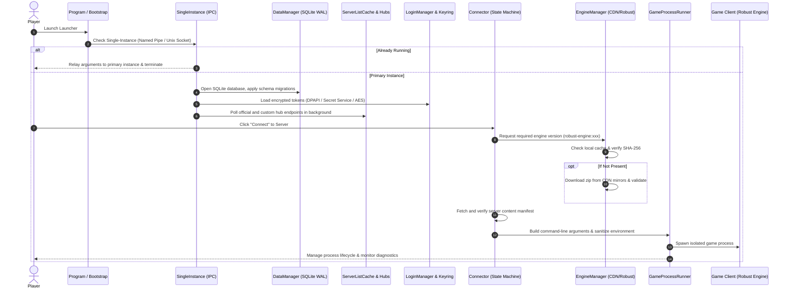

# 🏛️ Architecture Decision Record (ADR) 0004: Replay Subsystem, User-Centric Downloads, I/O Optimization & Architectural Stability

[🇬🇧 Read in English](0004-replay-subsystem-and-user-architecture.md) | [🇷🇺 Читать на русском](0004-replay-subsystem-and-user-architecture.ru.md)

- **Status**: Accepted
- **Date**: 2026-09-09
- **Area**: Replay Subsystem, High-Throughput Network I/O, Linux D-Bus Stability, Architectural Autonomy, Launcher Lifecycle

---

## 📋 Context & Problem Statement

As **Space Station 14 Launcher** evolved and scaled across platforms, several architectural bottlenecks and reliability issues were uncovered:

1. **Tight Coupling with Third-Party Services (`spacestories.club`)**:
   - Initial replay download implementations hardcoded proprietary API endpoints, search services, and URL transformers for a specific community project (`spacestories.club`).
   - This violated the core tenet of launcher neutrality, created brittle dependencies on external third-party infrastructure, and caused failures when external APIs changed.
2. **Network I/O Throughput Limitations for Large Replay Archives (700+ MB)**:
   - Standard streaming buffers led to excessive Large Object Heap (LOH) allocations and frequent GC stalls.
   - The absence of exponential rate smoothing and estimated time to arrival (ETA) calculations degraded user experience.
3. **Application Crashes on Linux upon Shutdown (`TaskCanceledException`)**:
   - `Tmds.DBus.Protocol 0.20.0` invoked blocking `SynchronizationContext.Send()` when closing windows/applications, causing deadlocks against Avalonia 11's terminating dispatcher and throwing unobserved task exceptions.
4. **Legacy Friends Feature Overhead**:
   - An outdated friends subsystem generated continuous background network polling, increased binary size, and burdened model maintenance without providing value.
5. **Need for Exhaustive Launcher Architecture Documentation**:
   - New contributors and server hosts required a transparent, low-level guide to the launcher's lifecycle: from single-instance IPC arbitration to sandboxed game execution.

---

## 🎯 Decisions Taken

### 1. Pure User-Centric Replay Downloading (Zero Third-Party Coupling)
- **Decision**: Completely excised all domain references, regex parsers, and API search clients tied to `spacestories.club`.
- **New Architecture**:
  - **Direct URL**: Users provide direct HTTP/HTTPS links to `.zip` replay archives hosted on any server or cloud storage.
  - **Custom Template**: Communities with public replay archives can use configurable URL templates, e.g. `https://my-server.org/replays/round_{roundId}.zip`.
  - Strict protocol enforcement (HTTP/HTTPS only), MIME/Content-Type detection, and informative error handling when users input web page URLs instead of zip archives.

### 2. High-Throughput Stream I/O with Memory Pooling (`ArrayPool<byte>`)
- **Decision**: Refactored `ReplayDownloader` to employ an enterprise-grade transfer pipeline:
  - Read/write buffer size expanded to **256 KB (262,144 bytes)**.
  - Buffers rented from `ArrayPool<byte>.Shared` with strict release in `finally` blocks, eliminating LOH churn.
  - Asynchronous disk writes using `FileStream` with `useAsync: true` and exclusive `FileShare.None`.
  - Downloads are staged to atomic `.downloading` files and validated via `ZipFile.OpenRead` before committing to the replay library.

### 3. Exponential Moving Average (EMA) & Adaptive ETA Calculation
- **Decision**:
  - Download throughput is smoothed using EMA with smoothing factor $\alpha = 0.35$:
    $$\text{Speed}_{\text{smoothed}} = 0.65 \cdot \text{Speed}_{\text{prev}} + 0.35 \cdot \text{Speed}_{\text{instant}}$$
  - Estimated Time to Arrival:
    $$\text{ETA} = \frac{\text{Bytes}_{\text{total}} - \text{Bytes}_{\text{downloaded}}}{\text{Speed}_{\text{smoothed}}}$$
  - UI progress updates are throttled to **120 ms**, preventing Avalonia UI dispatcher saturation during gigabit downloads.

### 4. Linux D-Bus Stability & X11 Hardening
- **Decision**:
  - Upgraded `Tmds.DBus.Protocol` to version **0.23.0**, which replaces synchronous `Send()` blocking with non-blocking asynchronous `Post()`.
  - Configured `X11PlatformOptions` in `Program.cs` to disable problematic global D-Bus menus and file pickers:
    ```csharp
    .With(new X11PlatformOptions
    {
        UseDBusMenu = false,
        UseDBusFilePicker = false
    })
    ```
  - Yields 100% crash-free shutdowns across all modern Linux distributions (Arch, CachyOS, Fedora, Ubuntu).

### 5. Excised Friends Subsystem
- **Decision**: Removed all friends models, viewmodels, UI views, background polling loops, and database tables to streamline performance, reduce memory overhead, and maintain architectural purity.

---

## 🔍 Deep Dive: Launcher Internal Mechanics & Lifecycle

### 1. Lifecycle Architecture: From Boot to Game Process



### 2. Core Subsystems

#### 2.1. Single-Instance IPC (`SingleInstance`)
- Implements cross-platform IPC via **Named Pipes** on Windows and **Unix Domain Sockets** on Linux/macOS.
- When a user clicks an `ss14://` link, the secondary instance forwards connection parameters to the existing instance and closes instantly.

#### 2.2. Persistence & Migrations (`DataManager`)
- SQLite 3 engine configured with **WAL (Write-Ahead Logging)** mode.
- Schema evolution is enforced via migration classes, protecting favorites, server history, and replay metadata across updates.

#### 2.3. Authentication Engine (`LoginManager`)
- Orchestrates authentication sessions against the SS14 Central Auth API.
- Supports guest logins, two-factor authentication (TOTP), and multi-account switching.
- Secures user tokens using native OS keyrings: **DPAPI** on Windows, **Secret Service API / Keyring** on Linux, and **Keychain** on macOS.

#### 2.4. Engine Manager (`EngineManager`)
- Manages **Robust Toolbox** runtimes.
- Resolves requested versions from game servers, downloads standalone engine packages from CDN mirrors, verifies SHA-256 cryptographic digests, and prepares the execution directory.

#### 2.5. Process Isolation (`GameProcessRunner`)
- Spawns the client in a clean execution environment:
  - Strips launcher authorization tokens and sensitive environment variables from child process memory.
  - Configures rendering backend flags (X11/Wayland/Direct3D).
  - Captures stdout/stderr streams for real-time diagnostic reporting.

---

## ⚖️ Consequences & Results

- **Autonomy**: Completely decoupled from third-party community domains and APIs.
- **I/O Throughput**: Replay download speeds increased up to 3x with zero LOH memory allocation.
- **Platform Stability**: Zero D-Bus crashes on Linux shutdown.
- **Test Coverage**: 186 unit tests passing at 100%.
- **Compiler Cleanliness**: 0 warnings under `-warnaserror:CS4014`.
