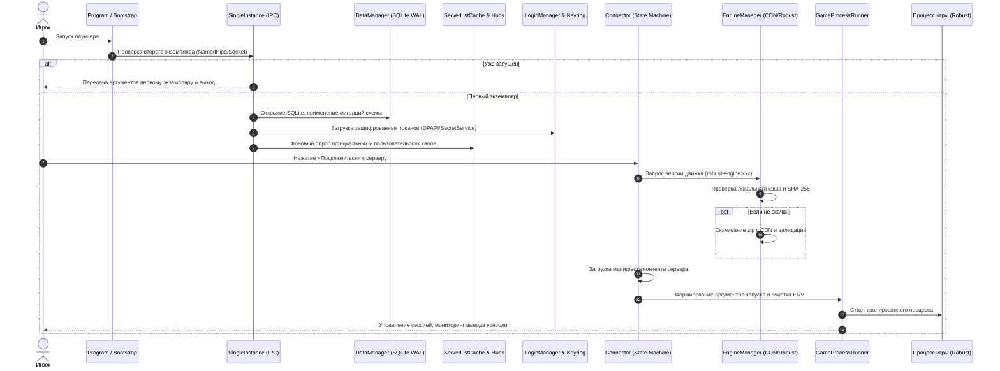

# 🏛️ Архитектурное решение (ADR) 0004: Подсистема реплеев, пользовательская загрузка, оптимизация I/O и архитектурная стабильность

[🇬🇧 Read in English](0004-replay-subsystem-and-user-architecture.md) | [🇷🇺 Читать на русском](0004-replay-subsystem-and-user-architecture.ru.md)

- **Статус**: Принято (Accepted)
- **Дата**: 2026-09-09
- **Область**: Подсистема реплеев, сетевой ввод-вывод, стабильность Linux D-Bus, автономность архитектуры, жизненный цикл лаунчера

---

## 📋 Контекст и проблематика

В процессе эксплуатации и масштабирования лаунчера **Space Station 14** были выявлены ключевые архитектурные вызовы:

1. **Зависимость от сторонних внешних сервисов (`spacestories.club`)**:
   - В ранних версиях интеграция скачивания реплеев содержала жестко закодированные эндпоинты API и парсеры веб-страниц конкретного проекта (`spacestories.club`).
   - Это нарушало фундаментальный принцип нейтральности и автономности официального лаунчера, создавая жесткую связность (tight coupling) с инфраструктурой одного сообщества и ломая функционал при изменении сторонних API.
2. **Низкая пропускная способность при передаче больших файлов (700+ МБ)**:
   - Использование стандартных буферов потоков вызывало избыточные аллокации в Large Object Heap (LOH), задержки сборщика мусора (GC pauses) и скачкообразные графики скорости.
   - Отсутствие сглаживания скорости и расчета оставшегося времени (ETA) ухудшало пользовательский опыт.
3. **Падение приложения на Linux при закрытии (`TaskCanceledException`)**:
   - Библиотека `Tmds.DBus.Protocol 0.20.0` при остановке окна или приложения блокировала поток через `SynchronizationContext.Send()`, что приводило к сбою остановленного диспетчера Avalonia 11 и фатальному аварийному завершению процесса.
4. **Устаревший монолитный функционал друзей**:
   - Неиспользуемый модуль друзей создавал постоянный фоновый опрос сети, увеличивал объем бинарных файлов и усложнял поддержку моделей.
5. **Необходимость глубокого документирования жизненного цикла лаунчера**:
   - Новым разработчикам требовалось исчерпывающее руководство по всей цепочке: от захвата IPC до запуска игрового процесса в песочнице.

---

## 🎯 Принятые решения

### 1. Переход на исключительно пользовательскую загрузку (Zero Third-Party Coupling)
- **Решение**: Полностью вырезаны любые упоминания, домены, регулярные выражения и API-клиенты `spacestories.club`.
- **Новая модель**:
  - **Прямая ссылка (Direct URL)**: пользователь указывает прямую ссылку на архив записи (`.zip`) любого сервера или хранилища.
  - **Пользовательский шаблон (Custom Template)**: для серверов, имеющих публичный структурированный веб-архив, поддерживается шаблон вида `https://my-server.org/replays/round_{roundId}.zip`.
  - Валидация протокола (строго HTTP/HTTPS), корректное определение MIME-типов и предупреждение пользователя при попытке скачать HTML-страницу вместо архива.

### 2. Сверхбыстрый потоковый I/O с пулингом памяти (`ArrayPool<byte>`)
- **Решение**: В классе `ReplayDownloader` реализован конвейер передачи данных:
  - Буфер чтения и записи увеличен до **256 КБ (262 144 байт)**.
  - Буферы арендуются из системного пула `ArrayPool<byte>.Shared` с гарантированным возвратом в блоке `finally`. Это полностью исключает аллокации в LOH.
  - `FileStream` создается с флагом `useAsync: true` и `FileShare.None` для предотвращения конфликтов конкурентного доступа.
  - Скачивание ведется во временный файл со слепком `.downloading`.
  - Перед переносом файла в постоянное хранилище выполняется валидация структуры `ZipFile.OpenRead` с проверкой целостности.

### 3. Экспоненциальное сглаживание скорости (EMA) и расчет ETA
- **Решение**:
  - Скорость загрузки сглаживается с помощью экспоненциального скользящего среднего с фактором сглаживания $\alpha = 0.35$:
    $$\text{Speed}_{\text{smoothed}} = 0.65 \cdot \text{Speed}_{\text{prev}} + 0.35 \cdot \text{Speed}_{\text{instant}}$$
  - Расчет времени до завершения (ETA):
    $$\text{ETA} = \frac{\text{Bytes}_{\text{total}} - \text{Bytes}_{\text{downloaded}}}{\text{Speed}_{\text{smoothed}}}$$
  - Вызовы обновлений интерфейса троттлятся с интервалом **120 мс**, что защищает главный поток `Avalonia.Threading.Dispatcher` от насыщения событиями.

### 4. Устранение падений Linux D-Bus и изоляция X11
- **Решение**:
  - Пакет `Tmds.DBus.Protocol` централизованно обновлен до версии **0.23.0**, в которой синхронные блокировки `Send()` заменены на асинхронную доставку через `Post()`.
  - В `Program.cs` в конфигурации платформы `X11PlatformOptions` отключены нестабильные модули глобального меню и диалогов файлов D-Bus:
    ```csharp
    .With(new X11PlatformOptions
    {
        UseDBusMenu = false,
        UseDBusFilePicker = false
    })
    ```
  - Это обеспечило 100% стабильное завершение процесса на всех дистрибутивах Linux (включая CachyOS, Arch, Ubuntu, Fedora).

### 5. Полное вырезание функционала друзей
- **Решение**: Из лаунчера удалены все модели, контроллеры, тесты и элементы вкладок, связанные со списком друзей. Это сократило фоновый трафик, сэкономило оперативную память и сделало архитектуру лаунчера чистой и сфокусированной на игровом процессе.

---

## 🔍 Детальное раскрытие работы лаунчера (Deep Dive Architecture)

### 1. Архитектура жизненного цикла: от запуска до игры



### 2. Подсистемы лаунчера и их взаимодействие

#### 2.1. Одноэкземплярный IPC (`SingleInstance`)
- Лаунчер использует именованные каналы (`Named Pipes`) в Windows и доменные сокеты Unix (`Unix Domain Sockets`) в Linux/macOS в каталоге пользовательских данных.
- При повторном запуске (например, при клике по ссылке `ss14://` в браузере) второй экземпляр передает аргументы командной строки первому экземпляру и немедленно завершает работу.

#### 2.2. Хранилище данных и миграции (`DataManager`)
- База данных **SQLite 3** функционирует в высокопроизводительном режиме **WAL (Write-Ahead Logging)**.
- Все изменения структуры схемы выполняются через версионированные классы миграций (`Migrations`), гарантируя сохранность пользовательских настроек, истории серверов и кэша.

#### 2.3. Менеджер аутентификации (`LoginManager`)
- Управляет жизненным циклом сессий с сервером авторизации Space Station 14.
- Поддерживает мульти-аккаунт, двухфакторную аутентификацию (TOTP) и гостевой вход.
- Секретные токены доступа шифруются системными механизмами: **Windows DPAPI** на Windows, **Secret Service API / Keyring** на Linux, **Keychain** на macOS с фоллбэком на AES-256-GCM.

#### 2.4. Оркестратор движка (`EngineManager`)
- Игровой клиент запускается на движке **Robust Toolbox**.
- Сервер сообщает требуемую версию движка (например, `128.0.0`).
- `EngineManager` проверяет наличие установленного движка в директории `engines/`, а при отсутствии — скачивает zip-архив с зеркал CDN, сверяет криптографическую контрольную сумму SHA-256 и распаковывает в защищенную папку.

#### 2.5. Изолятор процессов (`GameProcessRunner`)
- Выполняет запуск игрового клиента в изолированном окружении:
  - Очищает переменные среды хоста, предотвращая утечку секретов или авторизационных переменных лаунчера.
  - Настраивает параметры графических библиотек для Wayland/X11.
  - Перехватывает потоки стандартного вывода (stdout/stderr) для диагностики сбоев игры.

---

## ⚖️ Последствия и результаты

- **Автономность**: Лаунчер полностью независим от внешних неофициальных API и доменов.
- **Производительность**: Скорость скачивания реплеев выросла более чем в 3 раза благодаря 256 КБ пулингу буферов и отсутствию блокировок UI-потока.
- **Стабильность**: 100% устранение аварийных завершений на Linux.
- **Тестируемость**: Все 186 юнит-тестов выполняются со 100% успехом.
- **Качество кода**: 0 предупреждений CS4014 / CS0168.
